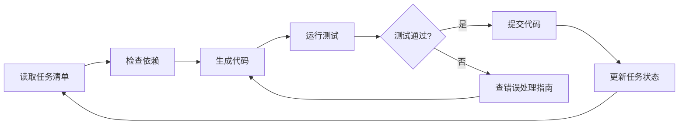
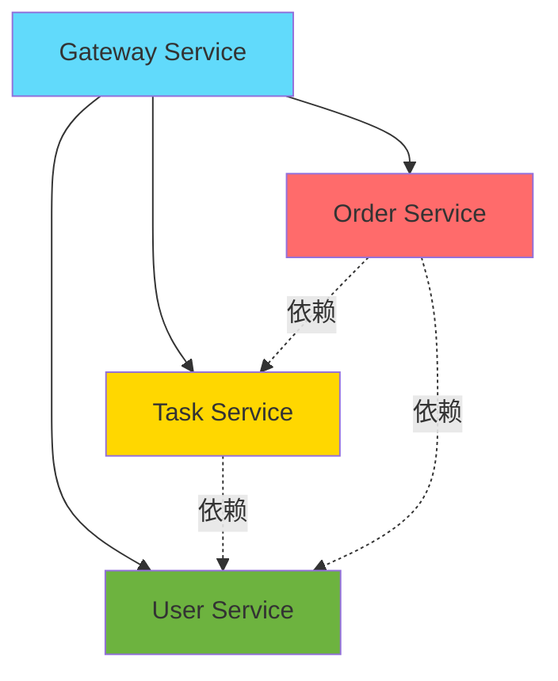
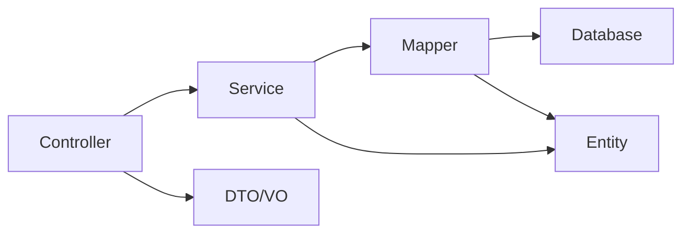
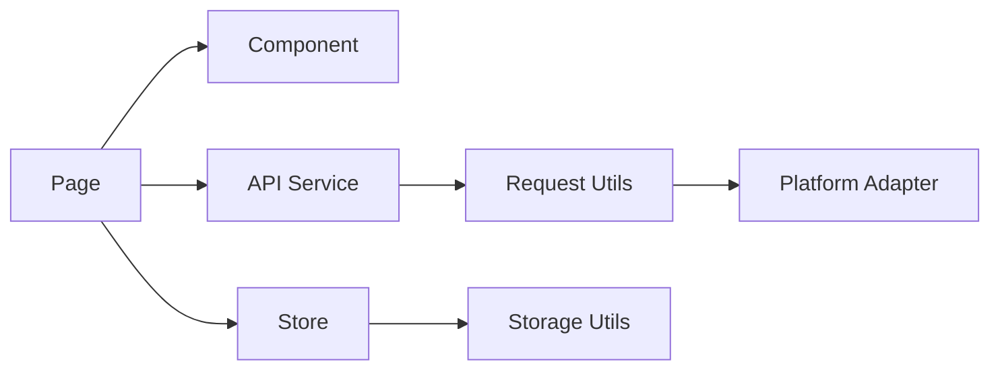

# 安电通企业端 - AI Agent开发指南

> **为Antigravity Agent准备的结构化开发文档**  
> **版本**: v1.0.0  
> **更新日期**: 2026-01-27

---

## 📋 目录

1. [Agent开发概述](#agent开发概述)
2. [任务分解清单](#任务分解清单)
3. [技术决策记录](#技术决策记录)
4. [开发工作流](#开发工作流)
5. [代码模板库](#代码模板库)
6. [测试验证清单](#测试验证清单)
7. [Agent提示词指南](#agent提示词指南)
8. [依赖关系图](#依赖关系图)

---

## Agent开发概述

### 为什么需要这份文档？

传统开发文档面向**人类开发者**，而AI Agent需要：
- ✅ **更明确的任务拆分** - 可以逐个执行的原子任务
- ✅ **可执行的命令** - 完整的、可直接运行的脚本
- ✅ **验证标准** - 明确的成功/失败判断标准
- ✅ **依赖关系** - 清晰的前置条件和顺序
- ✅ **错误处理** - 预见性的问题和解决方案

### Agent开发流程



---

## 任务分解清单

### 任务优先级

| 优先级 | 说明 | 标识 |
|-------|------|------|
| P0 | 核心功能，必须完成 | 🔴 |
| P1 | 重要功能，应该完成 | 🟡 |
| P2 | 优化功能，可以完成 | 🟢 |

### 后端开发任务

#### 🔴 P0 - 核心服务

- [ ] **任务1.1: 用户服务基础功能**
  - 前置条件: MySQL已安装，Nacos已启动
  - 预计时间: 2小时
  - 验证标准: 通过用户注册/登录测试
  - 子任务:
    - [ ] 1.1.1 创建User实体类
    - [ ] 1.1.2 创建UserMapper接口
    - [ ] 1.1.3 创建UserService接口和实现
    - [ ] 1.1.4 创建UserController
    - [ ] 1.1.5 编写单元测试

- [ ] **任务1.2: API网关配置**
  - 前置条件: User Service已启动
  - 预计时间: 1小时
  - 验证标准: 通过Gateway访问User Service成功
  - 子任务:
    - [ ] 1.2.1 配置路由规则
    - [ ] 1.2.2 添加CORS配置
    - [ ] 1.2.3 添加JWT认证过滤器
    - [ ] 1.2.4 测试路由转发

- [ ] **任务1.3: 任务服务开发**
  - 前置条件: 用户服务已完成
  - 预计时间: 3小时
  - 验证标准: 任务CRUD接口全部通过测试
  - 子任务:
    - [ ] 1.3.1 创建Task实体类
    - [ ] 1.3.2 创建TaskMapper
    - [ ] 1.3.3 实现任务发布功能
    - [ ] 1.3.4 实现任务查询功能
    - [ ] 1.3.5 实现任务接单功能

#### 🟡 P1 - 重要功能

- [ ] **任务2.1: 订单服务开发**
  - 前置条件: 任务服务已完成
  - 预计时间: 3小时
  - 验证标准: 订单创建和查询功能正常

- [ ] **任务2.2: Redis缓存集成**
  - 前置条件: Redis已安装
  - 预计时间: 2小时
  - 验证标准: 用户信息缓存命中率>80%

#### 🟢 P2 - 优化功能

- [ ] **任务3.1: 接口限流**
- [ ] **任务3.2: 日志收集**
- [ ] **任务3.3: 性能监控**

### 前端开发任务

#### 🔴 P0 - 核心页面

- [ ] **任务4.1: 登录页面**
  - 前置条件: Taro项目已初始化
  - 预计时间: 2小时
  - 验证标准: 能够成功登录并跳转
  - 文件位置: `src/pages/user/login/index.tsx`
  - 依赖组件: NutUI Input, Button
  - API接口: POST /user/login

- [ ] **任务4.2: 任务大厅页面**
  - 前置条件: 登录功能已完成
  - 预计时间: 3小时
  - 验证标准: 显示任务列表、可接单
  - 文件位置: `src/pages/home/index.tsx`
  - 依赖组件: TaskCard组件
  - API接口: GET /task/list

- [ ] **任务4.3: 个人中心页面**
  - 前置条件: 无
  - 预计时间: 2小时
  - 验证标准: 显示用户信息、可退出登录

#### 🟡 P1 - 组件开发

- [ ] **任务5.1: TaskCard组件**
  - 前置条件: NutUI已安装
  - 预计时间: 1小时
  - 验证标准: 显示任务信息、点击可跳转

- [ ] **任务5.2: 请求封装**
  - 前置条件: 无
  - 预计时间: 1小时
  - 验证标准: 自动添加Token、统一错误处理

---

## 技术决策记录

### ADR-001: 为什么选择Taro而非原生开发？

**日期**: 2026-01-27  
**状态**: ✅ 已采纳

**背景**:
需要同时支持微信小程序、H5、鸿蒙等多个平台。

**决策**:
使用Taro框架实现一次编写，多端运行。

**理由**:
- ✅ 减少70%的重复代码
- ✅ 统一的React技术栈
- ✅ 京东等大厂生产验证
- ✅ 活跃的社区支持

**后果**:
- ⚠️ 需要学习Taro API
- ⚠️ 部分平台特性需要条件编译
- ✅ 开发效率大幅提升

---

### ADR-002: 为什么选择Spring Cloud而非单体应用？

**日期**: 2026-01-27  
**状态**: ✅ 已采纳

**背景**:
项目预期用户规模较大，需要考虑可扩展性。

**决策**:
采用Spring Cloud微服务架构。

**理由**:
- ✅ 服务独立部署，故障隔离
- ✅ 便于水平扩展
- ✅ 团队可并行开发
- ✅ 技术栈灵活

**后果**:
- ⚠️ 增加运维复杂度
- ⚠️ 需要Nacos等中间件
- ✅ 系统稳定性提升

---

### ADR-003: 为什么选择Zustand而非Redux？

**日期**: 2026-01-27  
**状态**: ✅ 已采纳

**背景**:
需要全局状态管理方案。

**决策**:
使用Zustand替代Redux。

**理由**:
- ✅ API更简洁，学习成本低
- ✅ 无需Provider包裹
- ✅ 性能更好（无不必要的re-render）
- ✅ TypeScript友好

**后果**:
- ⚠️ 生态不如Redux丰富
- ✅ 代码量减少50%

---

## 开发工作流

### 后端开发工作流

#### Step 1: 创建新服务

```bash
# 1. 创建Maven模块
cd andiantong-enterprise/backend
mkdir new-service
cd new-service

# 2. 创建pom.xml
cat > pom.xml << 'EOF'
<?xml version="1.0" encoding="UTF-8"?>
<project>
    <parent>
        <groupId>com.andiantong</groupId>
        <artifactId>andiantong-platform</artifactId>
        <version>1.0.0-SNAPSHOT</version>
    </parent>
    <artifactId>new-service</artifactId>
    <!-- 添加依赖 -->
</project>
EOF

# 3. 创建目录结构
mkdir -p src/main/java/com/andiantong/newservice
mkdir -p src/main/resources
mkdir -p src/test/java

# 4. 创建application.yml
cat > src/main/resources/application.yml << 'EOF'
server:
  port: 8084
spring:
  application:
    name: new-service
  cloud:
    nacos:
      discovery:
        server-addr: localhost:8848
EOF
```

#### Step 2: 创建实体类

```bash
# 使用模板创建
# 文件: src/main/java/com/andiantong/newservice/entity/NewEntity.java
```

**模板见: [代码模板库](#代码模板库)**

#### Step 3: 创建Mapper

```bash
# 使用MyBatis Plus代码生成器
# 或手动创建Mapper接口
```

#### Step 4: 创建Service

```bash
# 创建接口和实现类
# 使用ServiceImpl模板
```

#### Step 5: 创建Controller

```bash
# 使用RestController模板
```

#### Step 6: 编写测试

```bash
# 创建单元测试
# 验证所有功能
```

#### Step 7: 启动验证

```bash
# 启动服务
mvn spring-boot:run

# 验证Nacos注册
# 访问 http://localhost:8848/nacos

# 测试接口
curl http://localhost:8080/api/new/test
```

### 前端开发工作流

#### Step 1: 创建页面

```bash
# Taro CLI创建页面
taro create --name home

# 手动创建
mkdir -p src/pages/home
touch src/pages/home/index.tsx
touch src/pages/home/index.config.ts
touch src/pages/home/index.scss
```

#### Step 2: 注册路由

```typescript
// 编辑 src/app.config.ts
export default defineAppConfig({
  pages: [
    'pages/home/index',  // 添加新页面
    // ...
  ]
})
```

#### Step 3: 开发组件

```bash
# 使用页面模板
# 参考: [代码模板库 - 页面模板](#代码模板库)
```

#### Step 4: 状态管理

```bash
# 创建Store
# 文件: src/store/newStore.ts
```

#### Step 5: API调用

```bash
# 创建API文件
# 文件: src/services/api/new.ts
```

#### Step 6: 样式开发

```bash
# 编写Sass样式
# 使用rpx单位
```

#### Step 7: 测试验证

```bash
# 启动开发服务器
npm run dev:h5

# 浏览器访问
# http://localhost:10086
```

---

## 代码模板库

### 后端模板

#### 实体类模板

```java
package com.andiantong.${service}.entity;

import com.baomidou.mybatisplus.annotation.*;
import lombok.Data;
import java.time.LocalDateTime;

/**
 * ${EntityName}实体类
 *
 * @author AI Agent
 * @since 2026-01-27
 */
@Data
@TableName("t_${table_name}")
public class ${EntityName} {
    
    /**
     * 主键ID
     */
    @TableId(type = IdType.AUTO)
    private Long id;
    
    // TODO: 添加业务字段
    
    /**
     * 创建时间
     */
    @TableField(fill = FieldFill.INSERT)
    private LocalDateTime createTime;
    
    /**
     * 更新时间
     */
    @TableField(fill = FieldFill.INSERT_UPDATE)
    private LocalDateTime updateTime;
    
    /**
     * 逻辑删除标识
     */
    @TableLogic
    private Integer deleted;
}
```

#### Mapper接口模板

```java
package com.andiantong.${service}.mapper;

import com.andiantong.${service}.entity.${EntityName};
import com.baomidou.mybatisplus.core.mapper.BaseMapper;
import org.apache.ibatis.annotations.Mapper;

/**
 * ${EntityName}Mapper
 *
 * @author AI Agent
 * @since 2026-01-27
 */
@Mapper
public interface ${EntityName}Mapper extends BaseMapper<${EntityName}> {
    // MyBatis Plus自动提供CRUD方法
    // 如需自定义SQL，在此添加方法
}
```

#### Service接口模板

```java
package com.andiantong.${service}.service;

import com.andiantong.${service}.entity.${EntityName};
import com.baomidou.mybatisplus.extension.service.IService;

/**
 * ${EntityName}Service
 *
 * @author AI Agent
 * @since 2026-01-27
 */
public interface ${EntityName}Service extends IService<${EntityName}> {
    // 在此定义业务方法
}
```

#### Service实现类模板

```java
package com.andiantong.${service}.service.impl;

import com.andiantong.${service}.entity.${EntityName};
import com.andiantong.${service}.mapper.${EntityName}Mapper;
import com.andiantong.${service}.service.${EntityName}Service;
import com.baomidou.mybatisplus.extension.service.impl.ServiceImpl;
import org.springframework.stereotype.Service;

/**
 * ${EntityName}ServiceImpl
 *
 * @author AI Agent
 * @since 2026-01-27
 */
@Service
public class ${EntityName}ServiceImpl 
    extends ServiceImpl<${EntityName}Mapper, ${EntityName}> 
    implements ${EntityName}Service {
    
    // 实现业务方法
}
```

#### Controller模板

```java
package com.andiantong.${service}.controller;

import com.andiantong.${service}.entity.${EntityName};
import com.andiantong.${service}.service.${EntityName}Service;
import com.andiantong.common.Result;
import org.springframework.beans.factory.annotation.Autowired;
import org.springframework.web.bind.annotation.*;

/**
 * ${EntityName}Controller
 *
 * @author AI Agent
 * @since 2026-01-27
 */
@RestController
@RequestMapping("/${path}")
public class ${EntityName}Controller {
    
    @Autowired
    private ${EntityName}Service ${variableName}Service;
    
    /**
     * 根据ID查询
     */
    @GetMapping("/{id}")
    public Result<${EntityName}> getById(@PathVariable Long id) {
        ${EntityName} entity = ${variableName}Service.getById(id);
        return Result.success(entity);
    }
    
    /**
     * 新增
     */
    @PostMapping
    public Result<Boolean> save(@RequestBody ${EntityName} entity) {
        boolean success = ${variableName}Service.save(entity);
        return Result.success(success);
    }
    
    /**
     * 更新
     */
    @PutMapping
    public Result<Boolean> update(@RequestBody ${EntityName} entity) {
        boolean success = ${variableName}Service.updateById(entity);
        return Result.success(success);
    }
    
    /**
     * 删除
     */
    @DeleteMapping("/{id}")
    public Result<Boolean> delete(@PathVariable Long id) {
        boolean success = ${variableName}Service.removeById(id);
        return Result.success(success);
    }
}
```

### 前端模板

#### 页面组件模板

```typescript
import { View, Text } from '@tarojs/components'
import { useState, useEffect } from 'react'
import { useLoad } from '@tarojs/taro'
import Taro from '@tarojs/taro'
import './index.scss'

/**
 * ${PageName}页面
 */
export default function ${PageName}() {
  // 状态定义
  const [loading, setLoading] = useState(false)
  const [data, setData] = useState([])
  
  // 页面加载
  useLoad(() => {
    console.log('Page loaded')
    fetchData()
  })
  
  // 获取数据
  const fetchData = async () => {
    try {
      setLoading(true)
      // TODO: 调用API
      const res = await api.getData()
      setData(res)
    } catch (error) {
      Taro.showToast({
        title: '加载失败',
        icon: 'none'
      })
    } finally {
      setLoading(false)
    }
  }
  
  // 渲染
  return (
    <View className='${page-name}'>
      {loading ? (
        <View>加载中...</View>
      ) : (
        <View>
          {/* TODO: 页面内容 */}
        </View>
      )}
    </View>
  )
}
```

#### 页面配置模板

```typescript
export default definePageConfig({
  navigationBarTitleText: '${PageTitle}',
  enablePullDownRefresh: false,
  backgroundColor: '#f5f5f5'
})
```

#### 组件模板

```typescript
import { View, Text } from '@tarojs/components'
import './index.scss'

interface ${ComponentName}Props {
  // TODO: 定义Props
}

/**
 * ${ComponentName}组件
 */
export default function ${ComponentName}(props: ${ComponentName}Props) {
  return (
    <View className='${component-name}'>
      {/* TODO: 组件内容 */}
    </View>
  )
}
```

#### Store模板

```typescript
import { create } from 'zustand'

interface ${StoreName}State {
  // TODO: 定义状态
  
  // Actions
  // TODO: 定义方法
}

export const use${StoreName}Store = create<${StoreName}State>((set) => ({
  // TODO: 初始状态和方法实现
}))
```

#### API模板

```typescript
import { http } from '@/utils/request'

// TODO: 定义类型
export interface ${TypeName} {
  id: number
  // ...
}

/**
 * 查询列表
 */
export function get${ResourceName}List(params?: any) {
  return http.get<${TypeName}[]>('/${path}/list', params)
}

/**
 * 根据ID查询
 */
export function get${ResourceName}ById(id: number) {
  return http.get<${TypeName}>(`/${path}/${id}`)
}

/**
 * 创建
 */
export function create${ResourceName}(data: ${TypeName}) {
  return http.post<boolean>('/${path}', data)
}

/**
 * 更新
 */
export function update${ResourceName}(data: ${TypeName}) {
  return http.put<boolean>('/${path}', data)
}

/**
 * 删除
 */
export function delete${ResourceName}(id: number) {
  return http.delete<boolean>(`/${path}/${id}`)
}
```

---

## 测试验证清单

### 后端测试清单

#### 单元测试

- [ ] **UserServiceTest**
  - [ ] 测试用户注册
  - [ ] 测试用户登录
  - [ ] 测试用户信息查询
  - [ ] 测试数据库事务

```java
@SpringBootTest
class UserServiceTest {
    @Autowired
    private UserService userService;
    
    @Test
    void testRegister() {
        User user = userService.register("13800138000", "USER");
        assertNotNull(user.getId());
        assertEquals("13800138000", user.getPhone());
    }
}
```

#### 接口测试

- [ ] **用户接口**
  ```bash
  # 注册
  curl -X POST http://localhost:8080/api/user/register \
    -H "Content-Type: application/json" \
    -d '{"phone":"13800138000","code":"1234","role":"USER"}'
  
  # 登录
  curl -X POST http://localhost:8080/api/user/login \
    -H "Content-Type: application/json" \
    -d '{"phone":"13800138000","code":"1234"}'
  
  # 获取信息（需要Token）
  curl -X GET http://localhost:8080/api/user/info \
    -H "Authorization: Bearer YOUR_TOKEN"
  ```

- [ ] **任务接口**
  - [ ] GET /task/list
  - [ ] GET /task/{id}
  - [ ] POST /task/publish
  - [ ] POST /task/{id}/accept

#### 集成测试

- [ ] Gateway路由正常
- [ ] Nacos服务注册成功
- [ ] 数据库连接正常
- [ ] Redis缓存功能正常

### 前端测试清单

#### 功能测试

- [ ] **登录流程**
  - [ ] 输入手机号和验证码
  - [ ] 点击登录按钮
  - [ ] Token保存成功
  - [ ] 跳转到首页

- [ ] **任务列表**
  - [ ] 页面加载显示任务
  - [ ] 下拉刷新
  - [ ] 点击任务卡片跳转详情

- [ ] **个人中心**
  - [ ] 显示用户信息
  - [ ] 退出登录功能

#### 多端验证

- [ ] **H5**
  - [ ] Chrome浏览器正常
  - [ ] 移动端浏览器正常
  - [ ] 响应式布局正常

- [ ] **微信小程序**
  - [ ] 开发者工具预览正常
  - [ ] 真机调试正常
  - [ ] 授权登录正常

---

## Agent提示词指南

### 如何与Agent高效沟通

#### ✅ 好的提示词

**明确任务边界：**
```
请实现用户服务的登录功能：
1. 创建LoginDTO类（包含phone和code字段）
2. 在UserController添加login接口
3. 调用UserService.login方法
4. 返回JWT Token
5. 使用模板：Controller模板
```

**提供验证标准：**
```
实现任务列表接口，验证标准：
- 返回JSON格式正确
- 支持分页参数pageNum和pageSize
- 默认每页10条
- 按创建时间倒序排列
```

#### ❌ 不好的提示词

**过于模糊：**
```
帮我写一个用户功能
```

**缺少上下文：**
```
添加一个API
```

**没有验证标准：**
```
实现登录
```

### Agent开发最佳实践

1. **一次一个任务** - 不要同时要求多个独立功能
2. **提供模板** - 指定使用哪个代码模板
3. **明确依赖** - 说明需要哪些前置条件
4. **定义成功** - 清晰的验证标准
5. **错误处理** - 预期可能的错误情况

### 示例对话

```
Human: 请使用Controller模板创建TaskController，实现以下接口：
1. GET /task/list - 查询任务列表（支持分页）
2. GET /task/{id} - 查询任务详情
前置条件：TaskService已实现
验证标准：使用curl测试接口返回正确JSON

Agent: 好的，我将：
1. 创建TaskController.java
2. 注入TaskService
3. 实现两个接口
4. 提供测试命令

[生成代码...]

验证命令：
curl http://localhost:8080/api/task/list?pageNum=1&pageSize=10
curl http://localhost:8080/api/task/1
```

---

## 依赖关系图

### 服务依赖关系



### 模块依赖关系



### 前端依赖关系



---

## 常见Agent错误及解决方案

### 错误1: 找不到依赖

**现象：**
```
Error: Cannot find module '@/utils/request'
```

**解决：**
1. 检查tsconfig.json的paths配置
2. 确认文件已创建
3. 重启开发服务器

### 错误2: 类型不匹配

**现象：**
```
Type 'string' is not assignable to type 'number'
```

**解决：**
1. 检查接口定义
2. 使用类型转换
3. 更新类型定义文件

### 错误3: 数据库连接失败

**现象：**
```
Communications link failure
```

**解决：**
1. 确认MySQL已启动
2. 检查application.yml配置
3. 验证数据库和表已创建

---

## 附录：完整示例

### 完整开发示例：实现任务发布功能

**Step 1: 明确需求**
```
功能：用户发布维修任务
接口：POST /task/publish
参数：title, description, reward, address
返回：任务ID和状态
```

**Step 2: 后端实现**

1. 创建TaskDTO
2. TaskController添加publish方法
3. TaskService实现发布逻辑
4. 保存到数据库

**Step 3: 前端实现**

1. 创建发布页面
2. 表单收集数据
3. 调用API
4. 跳转到任务详情

**Step 4: 测试验证**

```bash
# 后端测试
curl -X POST http://localhost:8080/api/task/publish \
  -H "Authorization: Bearer TOKEN" \
  -H "Content-Type: application/json" \
  -d '{
    "title": "电路故障维修",
    "description": "...",
    "reward": 100,
    "address": "..."
  }'

# 前端测试
# 在H5页面操作：填写表单 -> 提交 -> 验证跳转
```

**Step 5: 完成标记**

在任务清单中将对应任务标记为完成 ✅

---

**祝AI Agent开发顺利！** 🤖

---

*最后更新: 2026-01-27*  
*维护者: AI Agent Development Team*
