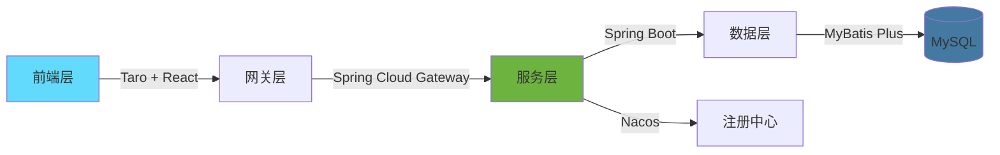
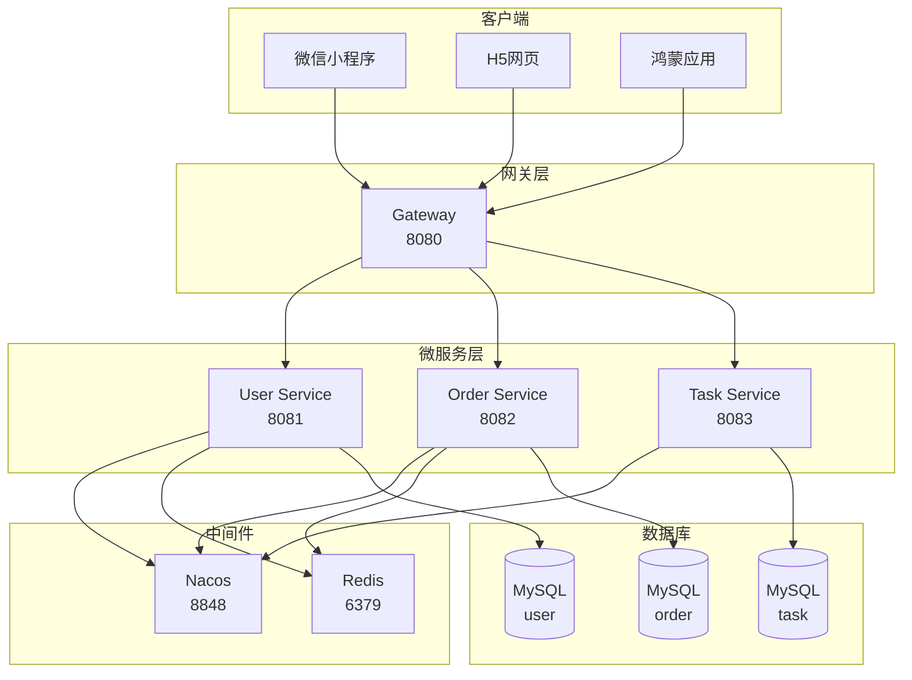

# 安电通企业端项目总览

> **企业级开发文档索引**  
> **版本**: v1.0.0  
> **更新日期**: 2026-01-27

---

## 📚 文档目录

欢迎来到**安电通企业端**项目！这里汇集了项目的所有开发文档。

### 核心文档

| 文档 | 适用人群 | 描述 |
|-----|---------|------|
| **[后端开发文档](./后端开发文档.md)** | 后端工程师 | Spring Cloud微服务架构、开发规范、数据库设计 |
| **[前端开发文档](./前端开发文档.md)** | 前端工程师 | Taro多端开发、组件规范、状态管理 |
| **[API接口文档](./API接口文档.md)** | 全栈工程师 | RESTful API定义、请求响应格式、错误码 |

---

## 🎯 项目概述

### 项目简介

**安电通企业端**是一个电工服务平台，连接用户和专业电工，提供任务发布、接单、订单管理等功能。

**核心价值：**
- 🔧 **用户侧**：快速找到专业电工解决电路问题
- 👷 **企业侧**：高效接单、任务管理、收益结算
- 📊 **平台侧**：交易撮合、质量管控、数据分析

### 技术栈一览



| 层级 | 技术选型 |
|-----|---------|
| **前端** | Taro 4.0 + React 18 + TypeScript + NutUI |
| **后端** | Spring Boot 3.2 + Spring Cloud 2023 + MyBatis Plus |
| **中间件** | Nacos + Redis + RabbitMQ |
| **数据库** | MySQL 8.0 |
| **部署** | Docker + Docker Compose |

---

## 📋 快速开始

### 前端开发入门

```bash
# 1. 安装依赖
cd andiantong-enterprise/frontend
npm install

# 2. 启动开发服务器
npm run dev:h5          # H5开发
npm run dev:weapp      # 微信小程序开发

# 3. 构建生产版本
npm run build:h5
npm run build:weapp
```

**详见：**[前端开发文档](./前端开发文档.md)

### 后端开发入门

```bash
# 1. 启动Nacos
cd nacos/bin
startup.cmd -m standalone

# 2. 创建数据库
mysql -u root -p
CREATE DATABASE andiantong_user;

# 3. 启动服务
cd andiantong-enterprise/backend/gateway
mvn spring-boot:run

cd ../user-service
mvn spring-boot:run
```

**详见：**[后端开发文档](./后端开发文档.md)

---

## 🏗️ 项目架构

### 整体架构图



### 服务端口分配

| 服务 | 端口 | 说明 |
|-----|------|------|
| Gateway | 8080 | API网关 |
| User Service | 8081 | 用户服务 |
| Order Service | 8082 | 订单服务 |
| Task Service | 8083 | 任务服务 |
| Nacos | 8848 | 注册/配置中心 |
| MySQL | 3306 | 数据库 |
| Redis | 6379 | 缓存 |

---

##目录结构

```
andiantong-enterprise/
├── backend/                    # 后端服务
│   ├── gateway/               # API网关
│   ├── user-service/         # 用户服务
│   ├── order-service/        # 订单服务（待开发）
│   ├── task-service/         # 任务服务（待开发）
│   └── pom.xml               # Maven父POM
│
├── frontend/                  # 前端应用
│   ├── config/               # 构建配置
│   ├── src/
│   │   ├── pages/           # 页面
│   │   ├── components/      # 组件
│   │   ├── store/           # 状态管理
│   │   └── utils/           # 工具函数
│   └── package.json
│
└── doc/                      # 📚 项目文档
    ├── 后端开发文档.md
    ├── 前端开发文档.md
    ├── API接口文档.md
    └── README.md             # 本文件
```

---

## 🔧 开发规范

### 代码规范

**后端：**
- 遵循阿里巴巴Java开发手册
- 使用Lombok简化代码
- 统一异常处理
- 接口注释完整

**前端：**
- 使用TypeScript严格模式
- ESLint + Prettier代码格式化
- 组件化开发
- 函数式组件 + Hooks

### Git规范

**分支管理：**
```
main         # 生产分支
develop      # 开发分支
feature/*    # 功能分支
hotfix/*     # 热修复分支
```

**提交格式：**
```
<type>(<scope>): <subject>

示例:
feat(user): 添加用户登录功能
fix(order): 修复订单金额计算错误
docs(api): 更新API文档
```

### 接口规范

- RESTful API设计
- 统一返回格式
- JWT Token认证
- 详见：[API接口文档](./API接口文档.md)

---

## 📊 数据库设计

### 核心表结构

#### 用户表 (t_user)
```sql
CREATE TABLE t_user (
    id BIGINT PRIMARY KEY AUTO_INCREMENT,
    phone VARCHAR(11) UNIQUE NOT NULL,
    nick_name VARCHAR(50),
    avatar VARCHAR(255),
    role VARCHAR(20) NOT NULL,
    status TINYINT DEFAULT 1,
    create_time DATETIME DEFAULT CURRENT_TIMESTAMP,
    update_time DATETIME DEFAULT CURRENT_TIMESTAMP ON UPDATE CURRENT_TIMESTAMP
);
```

#### 任务表 (t_task)
```sql
CREATE TABLE t_task (
    id BIGINT PRIMARY KEY AUTO_INCREMENT,
    title VARCHAR(100) NOT NULL,
    description TEXT,
    reward DECIMAL(10,2) NOT NULL,
    status VARCHAR(20) NOT NULL,
    publisher_id BIGINT NOT NULL,
    create_time DATETIME DEFAULT CURRENT_TIMESTAMP,
    update_time DATETIME DEFAULT CURRENT_TIMESTAMP ON UPDATE CURRENT_TIMESTAMP
);
```

**详见：**[后端开发文档 - 数据库设计](./后端开发文档.md#数据库设计)

---

## 🚀 部署指南

### 开发环境

**前置要求：**
- JDK 17+
- Node.js 18+
- MySQL 8.0+
- Nacos 2.3.0+

**启动步骤：**
1. 启动Nacos
2. 启动MySQL并创建数据库
3. 启动后端服务（Gateway → User Service）
4. 启动前端开发服务器

### 生产环境

**Docker部署：**
```bash
# 构建镜像
docker-compose build

# 启动所有服务
docker-compose up -d

# 查看日志
docker-compose logs -f
```

**详见：**[后端开发文档 - 部署指南](./后端开发文档.md#部署指南)

---

## 🤝 团队协作

### 团队分工

| 角色 | 职责 |
|-----|------|
| **前端工程师** | 页面开发、组件封装、状态管理 |
| **后端工程师** | 接口开发、业务逻辑、数据库设计 |
| **测试工程师** | 功能测试、接口测试、性能测试 |
| **产品经理** | 需求管理、功能设计、验收 |

### 开发流程


---

## 📞 联系方式

### 技术支持

- **后端团队**: backend-dev@andiantong.com
- **前端团队**: frontend-dev@andiantong.com
- **API文档**: api-dev@andiantong.com

### 问题反馈

遇到问题？请通过以下方式反馈：
1. 📧 发送邮件到相应团队邮箱
2. 💬 在团队协作平台创建Issue
3. 📝 更新文档并提交PR

---

## 📝 更新日志

### v1.0.0 (2026-01-27)

**后端：**
- ✅ 完成用户服务开发
- ✅ 完成API网关配置
- ✅ 集成Nacos注册中心
- 🚧 订单服务开发中
- 🚧 任务服务开发中

**前端：**
- ✅ 完成Taro项目初始化
- ✅ 完成登录页面开发
- ✅ 完成任务大厅页面
- ✅ 完成个人中心页面
- 🚧 鸿蒙适配开发中

**文档：**
- ✅ 后端开发文档
- ✅ 前端开发文档
- ✅ API接口文档
- ✅ 项目总览文档

---

## 🎓 学习资源

### 官方文档

- [Spring Boot文档](https://spring.io/projects/spring-boot)
- [Spring Cloud文档](https://spring.io/projects/spring-cloud)
- [Taro文档](https://taro-docs.jd.com/)
- [React文档](https://react.dev/)
- [TypeScript文档](https://www.typescriptlang.org/)

### 推荐阅读

- 《阿里巴巴Java开发手册》
- 《深入浅出Spring Boot 3.x》
- 《React设计模式与最佳实践》
- 《微服务架构设计模式》

---

**祝开发愉快！** 🎉

---

*最后更新: 2026-01-27*  
*维护团队: 安电通技术团队*
