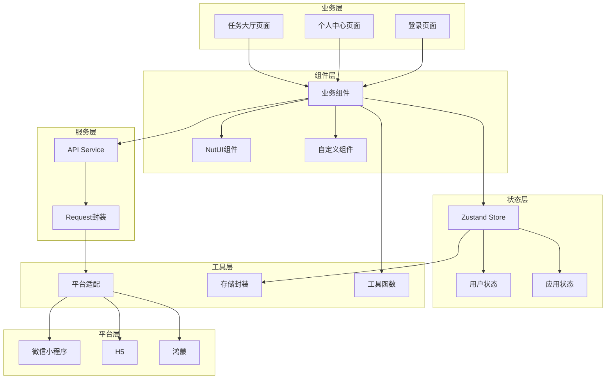

# 安电通企业端前端开发文档

> **版本**: v1.0.0  
> **更新日期**: 2026-01-27  
> **适用人群**: 前端开发工程师

---

## 📋 目录

1. [项目概述](#项目概述)
2. [技术架构](#技术架构)
3. [环境搭建](#环境搭建)
4. [项目结构](#项目结构)
5. [开发规范](#开发规范)
6. [组件开发](#组件开发)
7. [状态管理](#状态管理)
8. [API调用](#api调用)
9. [多端适配](#多端适配)
10. [构建部署](#构建部署)
11. [常见问题](#常见问题)

---

## 项目概述

### 业务背景

**安电通企业端前端**是基于Taro框架开发的多端应用，一次编写可运行在微信小程序、H5、鸿蒙等多个平台。

**核心功能：**
- 📋 任务大厅（查看、接单）
- 👤 个人中心（信息管理、统计）
- 🔐 登录注册（手机号验证）

### 技术选型

| 技术栈 | 版本 | 说明 |
|-------|------|------|
| **Taro** | 4.0+ | 跨端框架 |
| **React** | 18.0+ | UI框架 |
| **TypeScript** | 5.0+ | 类型安全 |
| **NutUI React Taro** | 2.0+ | UI组件库 |
| **Zustand** | 4.5+ | 状态管理 |
| **Sass** | 1.97+ | CSS预处理器 |

### 支持平台

| 平台 | 构建命令 | 状态 |
|-----|---------|------|
| 微信小程序 | `npm run dev:weapp` | ✅ 已支持 |
| H5 | `npm run dev:h5` | ✅ 已支持 |
| 鸿蒙 | `npm run dev:harmony` | 🚧 计划中 |
| 支付宝小程序 | `npm run dev:alipay` | 🚧 计划中 |

---

## 技术架构

### 整体架构图



### 分层架构

| 层级 | 职责 | 示例 |
|-----|------|------|
| **页面层** | 路由页面、页面逻辑 | `pages/home/index.tsx` |
| **组件层** | 可复用UI组件 | `components/TaskCard.tsx` |
| **服务层** | API接口调用 | `services/api/task.ts` |
| **状态层** | 全局状态管理 | `store/user.ts` |
| **工具层** | 工具函数、平台适配 | `utils/platform.ts` |

---

## 环境搭建

### 开发环境要求

**必需：**
- ✅ Node.js 18+
- ✅ npm 9+ 或 pnpm 8+
- ✅ VSCode（推荐）

**平台开发工具：**
- 微信小程序：微信开发者工具
- H5：Chrome浏览器
- 鸿蒙：DevEco Studio 5.0.3+

### 安装步骤

#### 1. 安装Node.js

```bash
# 下载Node.js 18 LTS
# https://nodejs.org/

# 验证安装
node -v
npm -v
```

#### 2. 安装项目依赖

```bash
cd c:\Users\21389\Downloads\12259\andiantong-enterprise\frontend

# 安装依赖
npm install

# 如果速度慢，使用淘宝镜像
npm config set registry https://registry.npmmirror.com
npm install
```

#### 3. 安装Taro CLI

```bash
# 全局安装
npm install -g @tarojs/cli

# 验证安装
taro -v
```

#### 4. VSCode插件推荐

- **Taro UI Helper** - Taro组件提示
- **ES7+ React/Redux** - React代码片段
- **ESLint** - 代码规范检查
- **Prettier** - 代码格式化
- **TypeScript Vue Plugin** - TypeScript支持

### 启动项目

```bash
# 开发微信小程序
npm run dev:weapp
# 然后用微信开发者工具打开 dist/weapp

# 开发H5
npm run dev:h5
# 浏览器访问 http://localhost:10086

# 构建生产版本
npm run build:weapp
npm run build:h5
```

---

## 项目结构

### 完整目录结构

```
andiantong-enterprise/frontend/
├── config/                      # 构建配置
│   ├── index.ts                # 主配置
│   ├── dev.ts                  # 开发配置
│   └── prod.ts                 # 生产配置
│
├── src/
│   ├── app.tsx                 # 应用入口
│   ├── app.config.ts          # 应用配置（页面路由、TabBar）
│   ├── app.scss               # 全局样式
│   │
│   ├── pages/                 # 📱 页面
│   │   ├── home/             # 任务大厅
│   │   │   ├── index.tsx
│   │   │   ├── index.config.ts
│   │   │   └── index.scss
│   │   ├── profile/          # 个人中心
│   │   └── user/             # 用户相关
│   │       └── login/        # 登录页
│   │
│   ├── components/           # 🧩 组件
│   │   ├── TaskCard/        # 任务卡片
│   │   │   ├── index.tsx
│   │   │   └── index.scss
│   │   └── ...
│   │
│   ├── store/               # 📊 状态管理
│   │   └── user.ts         # 用户状态
│   │
│   ├── utils/              # 🛠️ 工具函数
│   │   ├── request.ts     # 请求封装
│   │   └── auth.ts        # 认证工具
│   │
│   └── types/             # 📝 类型定义
│       └── index.d.ts
│
├── .eslintrc.js           # ESLint配置
├── .prettierrc            # Prettier配置
├── tsconfig.json          # TypeScript配置
├── package.json           # 依赖配置
└── project.config.json    # 小程序项目配置
```

### 页面目录结构

```
pages/home/
├── index.tsx              # 页面组件（必需）
├── index.config.ts       # 页面配置（可选）
└── index.scss            # 页面样式（可选）
```

**index.tsx 示例：**
```tsx
import { View, Text } from '@tarojs/components'
import { useLoad } from '@tarojs/taro'
import './index.scss'

export default function Home() {
  useLoad(() => {
    console.log('Page loaded.')
  })

  return (
    <View className='home'>
      <Text>任务大厅</Text>
    </View>
  )
}
```

**index.config.ts 示例：**
```ts
export default definePageConfig({
  navigationBarTitleText: '任务大厅',
  enablePullDownRefresh: true
})
```

---

## 开发规范

### 代码规范

#### 1. 命名规范

**文件命名：**
- 组件文件：PascalCase（`TaskCard.tsx`）
- 工具文件：camelCase（`request.ts`）
- 样式文件：与组件同名（`TaskCard.scss`）

**变量命名：**
```tsx
// ✅ 推荐
const userName = 'zhangsan'
const isLoading = false
const handleClick = () => {}

// ❌ 不推荐
const user_name = 'zhangsan'  // 不要用下划线
const flag = false            // 不明确的命名
```

**组件命名：**
```tsx
// ✅ 函数组件 - PascalCase
export default function TaskCard() {}

// ✅ 自定义Hook - use开头
export function useRequest() {}

// ❌ 不推荐
export default function taskCard() {}
```

#### 2. TypeScript规范

```tsx
// ✅ 推荐：定义Props接口
interface TaskCardProps {
  id: number
  title: string
  status: 'pending' | 'completed'
  onPress?: () => void
}

export default function TaskCard(props: TaskCardProps) {
  const { id, title, status, onPress } = props
  return <View onClick={onPress}>{title}</View>
}

// ❌ 不推荐：使用any
function TaskCard(props: any) {}
```

#### 3. 组件编写规范

```tsx
import { View, Text } from '@tarojs/components'
import { useState, useEffect } from 'react'
import Taro from '@tarojs/taro'
import './index.scss'

// 1. 类型定义
interface TaskCardProps {
  data: Task
}

// 2. 函数组件
export default function TaskCard(props: TaskCardProps) {
  // 2.1 Hook声明
  const [loading, setLoading] = useState(false)
  
  // 2.2 生命周期
  useEffect(() => {
    // 初始化逻辑
  }, [])
  
  // 2.3 事件处理函数
  const handleClick = () => {
    Taro.navigateTo({ url: '/pages/detail/index' })
  }
  
  // 2.4 渲染逻辑
  if (loading) {
    return <View>加载中...</View>
  }
  
  // 2.5 JSX返回
  return (
    <View className='task-card' onClick={handleClick}>
      <Text>{props.data.title}</Text>
    </View>
  )
}
```

### 样式规范

#### 1. 使用Sass

```scss
// ✅ 推荐：使用嵌套和变量
.task-card {
  padding: 20px;
  background: #fff;
  
  &__title {
    font-size: 32px;
    color: #333;
  }
  
  &__status {
    color: $primary-color;
  }
}

// ❌ 不推荐：平铺样式
.task-card { padding: 20px; }
.task-card-title { font-size: 32px; }
```

#### 2. 响应式单位

```scss
// ✅ 使用rpx（Taro会自动转换）
.box {
  width: 750rpx;      // 等于屏幕宽度
  height: 200rpx;
  font-size: 28rpx;
}

// ❌ 不要混用px和rpx
.box {
  width: 750rpx;
  padding: 10px;  // 会导致不同设备显示不一致
}
```

### Git提交规范

```bash
# 格式：<type>(<scope>): <subject>

# 示例
feat(home): 添加任务列表组件
fix(login): 修复验证码倒计时问题
docs(readme): 更新开发文档
style(task): 调整任务卡片样式
refactor(api): 重构请求拦截器
```

**type类型：**
- `feat`: 新功能
- `fix`: Bug修复
- `docs`: 文档更新
- `style`: 样式调整
- `refactor`: 代码重构
- `test`: 测试相关
- `chore`: 构建/工具变动

---

## 组件开发

### NutUI组件库使用

#### 1. 导入组件

```tsx
import { Button, Cell, Input } from '@nutui/nutui-react-taro'

export default function LoginPage() {
  return (
    <View>
      <Cell title='手机号'>
        <Input type='tel' placeholder='请输入手机号' />
      </Cell>
      <Button type='primary' block>登录</Button>
    </View>
  )
}
```

#### 2. 常用组件

| 组件 | 用途 | 示例 |
|-----|------|------|
| **Button** | 按钮 | `<Button type="primary">提交</Button>` |
| **Cell** | 单元格 | `<Cell title="标题" desc="描述" />` |
| **Input** | 输入框 | `<Input placeholder="请输入" />` |
| **Toast** | 提示 | `Toast.show('操作成功')` |
| **Dialog** | 对话框 | `Dialog.confirm({...})` |
| **Tabs** | 标签页 | `<Tabs><TabPane /></Tabs>` |

### 自定义组件开发

**示例：TaskCard组件**

```tsx
// components/TaskCard/index.tsx
import { View, Text } from '@tarojs/components'
import { Button } from '@nutui/nutui-react-taro'
import './index.scss'

interface TaskCardProps {
  id: number
  title: string
  reward: number
  status: 'pending' | 'accepted' | 'completed'
  onAccept?: (id: number) => void
}

export default function TaskCard(props: TaskCardProps) {
  const { id, title, reward, status, onAccept } = props
  
  const statusText = {
    pending: '待接单',
    accepted: '进行中',
    completed: '已完成'
  }
  
  return (
    <View className='task-card'>
      <View className='task-card__header'>
        <Text className='task-card__title'>{title}</Text>
        <Text className='task-card__reward'>¥{reward}</Text>
      </View>
      <View className='task-card__footer'>
        <Text className='task-card__status'>{statusText[status]}</Text>
        {status === 'pending' && (
          <Button 
            size='small' 
            type='primary'
            onClick={() => onAccept?.(id)}
          >
            接单
          </Button>
        )}
      </View>
    </View>
  )
}
```

**样式：**
```scss
// components/TaskCard/index.scss
.task-card {
  background: #fff;
  border-radius: 16rpx;
  padding: 32rpx;
  margin-bottom: 24rpx;
  
  &__header {
    display: flex;
    justify-content: space-between;
    align-items: center;
    margin-bottom: 24rpx;
  }
  
  &__title {
    font-size: 32rpx;
    font-weight: 500;
    color: #333;
  }
  
  &__reward {
    font-size: 36rpx;
    font-weight: bold;
    color: #ff4d4f;
  }
  
  &__footer {
    display: flex;
    justify-content: space-between;
    align-items: center;
  }
  
  &__status {
    font-size: 28rpx;
    color: #999;
  }
}
```

---

## 状态管理

### Zustand使用

#### 1. 创建Store

```tsx
// store/user.ts
import { create } from 'zustand'

interface UserInfo {
  id: number
  phone: string
  nickName: string
  role: string
}

interface UserState {
  token: string | null
  userInfo: UserInfo | null
  isLogin: boolean
  
  // Actions
  setToken: (token: string) => void
  setUserInfo: (info: UserInfo) => void
  login: (token: string, info: UserInfo) => void
  logout: () => void
}

export const useUserStore = create<UserState>((set) => ({
  token: null,
  userInfo: null,
  isLogin: false,
  
  setToken: (token) => set({ token, isLogin: !!token }),
  
  setUserInfo: (userInfo) => set({ userInfo }),
  
  login: (token, userInfo) => set({ 
    token, 
    userInfo, 
    isLogin: true 
  }),
  
  logout: () => set({ 
    token: null, 
    userInfo: null, 
    isLogin: false 
  })
}))
```

#### 2. 使用Store

```tsx
// pages/profile/index.tsx
import { useUserStore } from '@/store/user'

export default function ProfilePage() {
  // 获取状态
  const userInfo = useUserStore(state => state.userInfo)
  const logout = useUserStore(state => state.logout)
  
  // 使用
  const handleLogout = () => {
    logout()
    Taro.reLaunch({ url: '/pages/user/login/index' })
  }
  
  return (
    <View>
      <Text>{userInfo?.nickName}</Text>
      <Button onClick={handleLogout}>退出登录</Button>
    </View>
  )
}
```

---

## API调用

### 请求封装

```tsx
// utils/request.ts
import Taro from '@tarojs/taro'
import { useUserStore } from '@/store/user'

const baseURL = 'http://localhost:8080/api'

interface RequestOptions {
  url: string
  method?: 'GET' | 'POST' | 'PUT' | 'DELETE'
  data?: any
  header?: Record<string, string>
}

export async function request<T = any>(options: RequestOptions): Promise<T> {
  const { url, method = 'GET', data, header = {} } = options
  
  // 获取Token
  const token = useUserStore.getState().token
  if (token) {
    header['Authorization'] = `Bearer ${token}`
  }
  
  try {
    Taro.showLoading({ title: '加载中...' })
    
    const res = await Taro.request({
      url: baseURL + url,
      method,
      data,
      header: {
        'Content-Type': 'application/json',
        ...header
      }
    })
    
    const { code, data: resData, message } = res.data as any
    
    if (code === 0) {
      return resData
    } else {
      throw new Error(message || '请求失败')
    }
  } catch (error) {
    Taro.showToast({
      title: error.message || '网络错误',
      icon: 'none'
    })
    throw error
  } finally {
    Taro.hideLoading()
  }
}

// 便捷方法
export const http = {
  get: <T = any>(url: string, data?: any) => 
    request<T>({ url, method: 'GET', data }),
    
  post: <T = any>(url: string, data?: any) => 
    request<T>({ url, method: 'POST', data }),
    
  put: <T = any>(url: string, data?: any) => 
    request<T>({ url, method: 'PUT', data }),
    
  delete: <T = any>(url: string, data?: any) => 
    request<T>({ url, method: 'DELETE', data })
}
```

### API接口定义

```tsx
// services/api/user.ts
import { http } from '@/utils/request'

export interface LoginParams {
  phone: string
  code: string
}

export interface LoginResult {
  token: string
  user: {
    id: number
    phone: string
    nickName: string
  }
}

// 用户登录
export function login(data: LoginParams) {
  return http.post<LoginResult>('/user/login', data)
}

// 获取用户信息
export function getUserInfo() {
  return http.get('/user/info')
}
```

### 使用API

```tsx
// pages/user/login/index.tsx
import { useState } from 'react'
import { login } from '@/services/api/user'
import { useUserStore } from '@/store/user'

export default function LoginPage() {
  const [phone, setPhone] = useState('')
  const [code, setCode] = useState('')
  const userLogin = useUserStore(state => state.login)
  
  const handleLogin = async () => {
    try {
      const res = await login({ phone, code })
      userLogin(res.token, res.user)
      
      Taro.showToast({ title: '登录成功' })
      Taro.switchTab({ url: '/pages/home/index' })
    } catch (error) {
      // 错误已在request中处理
    }
  }
  
  return (
    <View>
      <Input value={phone} onInput={e => setPhone(e.detail.value)} />
      <Input value={code} onInput={e => setCode(e.detail.value)} />
      <Button onClick={handleLogin}>登录</Button>
    </View>
  )
}
```

---

## 多端适配

### 平台判断

```tsx
import Taro from '@tarojs/taro'

// 判断当前平台
const env = Taro.getEnv()

if (env === Taro.ENV_TYPE.WEAPP) {
  // 微信小程序特有逻辑
} else if (env === Taro.ENV_TYPE.WEB) {
  // H5特有逻辑
}
```

### 条件编译

```tsx
// process.env.TARO_ENV
if (process.env.TARO_ENV === 'weapp') {
  // 微信小程序
} else if (process.env.TARO_ENV === 'h5') {
  // H5
}
```

### 样式适配

```scss
// 微信小程序特定样式
/* #ifdef WEAPP */
.box {
  padding-top: 88rpx; // 适配导航栏
}
/* #endif */

// H5特定样式
/* #ifdef H5 */
.box {
  padding-top: 44px;
}
/* #endif */
```

---

## 构建部署

### 本地开发

```bash
# 微信小程序
npm run dev:weapp
# 用微信开发者工具打开 dist/weapp

# H5
npm run dev:h5
# 浏览器访问 http://localhost:10086
```

### 生产构建

```bash
# 微信小程序
npm run build:weapp

# H5
npm run build:h5
# 产物在 dist/h5，部署到静态服务器
```

### 小程序发布

1. 微信开发者工具打开项目
2. 点击"上传"
3. 填写版本号和备注
4. 登录小程序管理后台
5. 提交审核

### H5部署

```bash
# 构建
npm run build:h5

# 部署到Nginx
cp -r dist/h5/* /usr/share/nginx/html/

# 或部署到OSS等静态托管服务
```

---

## 常见问题

### Q1: 组件样式不生效？

**问题：**写了样式但页面没有变化

**解决：**
1. 检查样式文件是否导入：`import './index.scss'`
2. 检查className是否正确
3. 使用rpx而不是px
4. 清除缓存重新编译

### Q2: 接口请求失败？

**问题：**调用API返回403或网络错误

**解决：**
1. 检查后端服务是否启动
2. 检查请求URL是否正确
3. 微信小程序需要配置合法域名
4. H5检查是否跨域

### Q3: 路由跳转失败？

**问题：**`Taro.navigateTo`没反应

**解决：**
1. 检查路径是否正确（必须以`/`开头）
2. TabBar页面使用`Taro.switchTab`
3. 确保目标页面在`app.config.ts`中注册

### Q4: TypeScript报错？

**问题：**TS类型检查报错

**解决：**
1. 确保安装了`@types/react`
2. 检查`tsconfig.json`配置
3. 重启VSCode
4. 运行`npm run type-check`

---

## 附录

### Taro API常用方法

| API | 用途 | 示例 |
|-----|------|------|
| **navigateTo** | 跳转页面 | `Taro.navigateTo({ url: '/pages/detail/index' })` |
| **redirectTo** | 重定向 | `Taro.redirectTo({ url: '/pages/login/index' })` |
| **switchTab** | 切换Tab | `Taro.switchTab({ url: '/pages/home/index' })` |
| **showToast** | 提示 | `Taro.showToast({ title: '成功' })` |
| **showLoading** | 加载中 | `Taro.showLoading({ title: '加载中...' })` |
| **request** | 网络请求 | `Taro.request({ url: '...' })` |
| **setStorage** | 存储 | `Taro.setStorage({ key: 'token', data: '...' })` |

### 参考资料

- [Taro官方文档](https://taro-docs.jd.com/)
- [React官方文档](https://react.dev/)
- [NutUI Taro文档](https://nutui.jd.com/taro/react/)
- [TypeScript文档](https://www.typescriptlang.org/docs/)
- [Zustand文档](https://zustand-demo.pmnd.rs/)

---

**文档维护**: 前端开发组  
**联系方式**: frontend-dev@andiantong.com
