# 安电通企业端功能调用链路

> **完整的前后端调用链路图**  
> **版本**: v1.0.0  
> **更新日期**: 2026-01-27

---

## 📋 目录

1. [用户功能链路](#用户功能链路)
2. [任务功能链路](#任务功能链路)
3. [订单功能链路](#订单功能链路)
4. [通用链路说明](#通用链路说明)
5. [错误处理链路](#错误处理链路)

---

## 用户功能链路

### 1. 用户注册流程

**完整调用链路：**

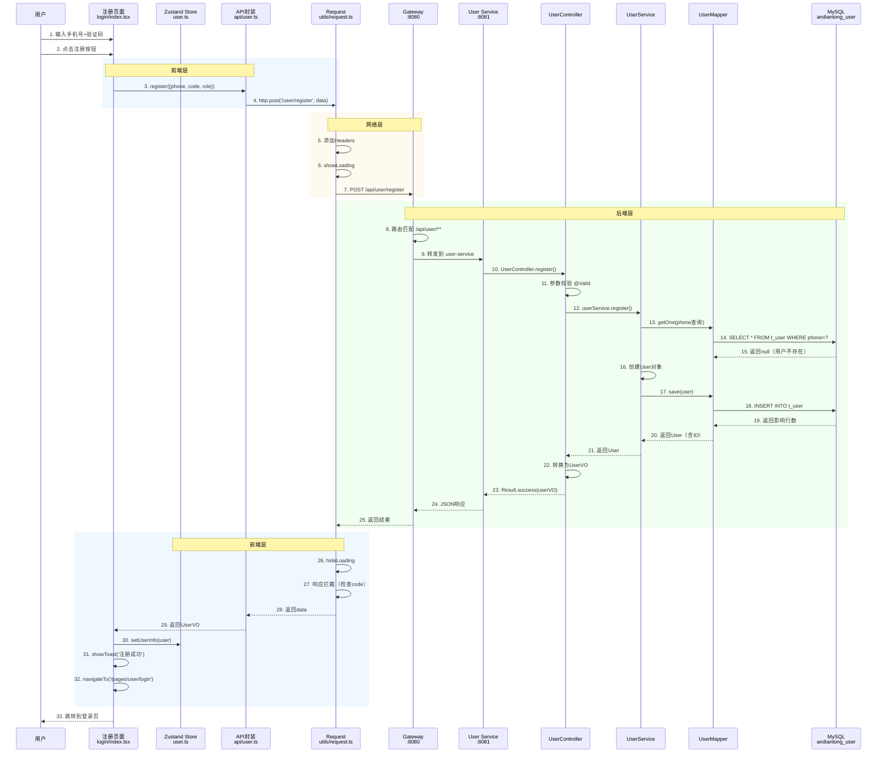
```mermaid
sequenceDiagram
    participant U as 用户
    participant P as 注册页面<br/>login/index.tsx
    participant S as Zustand Store<br/>user.ts
    participant A as API封装<br/>api/user.ts
    participant R as Request<br/>utils/request.ts
    participant G as Gateway<br/>:8080
    participant US as User Service<br/>:8081
    participant C as UserController
    participant SV as UserService
    participant M as UserMapper
    participant DB as MySQL<br/>andiantong_user
    
    U->>P: 1. 输入手机号+验证码
    U->>P: 2. 点击注册按钮
    
    rect rgb(240, 248, 255)
        Note over P,A: 前端层
        P->>A: 3. register({phone, code, role})
        A->>R: 4. http.post('/user/register', data)
    end
    
    rect rgb(255, 250, 240)
        Note over R,G: 网络层
        R->>R: 5. 添加Headers
        R->>R: 6. showLoading
        R->>G: 7. POST /api/user/register
    end
    
    rect rgb(240, 255, 240)
        Note over G,DB: 后端层
        G->>G: 8. 路由匹配 /api/user/**
        G->>US: 9. 转发到 user-service
        US->>C: 10. UserController.register()
        C->>C: 11. 参数校验 @Valid
        C->>SV: 12. userService.register()
        SV->>M: 13. getOne(phone查询)
        M->>DB: 14. SELECT * FROM t_user WHERE phone=?
        DB-->>M: 15. 返回null（用户不存在）
        SV->>SV: 16. 创建User对象
        SV->>M: 17. save(user)
        M->>DB: 18. INSERT INTO t_user
        DB-->>M: 19. 返回影响行数
        M-->>SV: 20. 返回User（含ID）
        SV-->>C: 21. 返回User
        C->>C: 22. 转换为UserVO
        C-->>US: 23. Result.success(userVO)
        US-->>G: 24. JSON响应
        G-->>R: 25. 返回结果
    end
    
    rect rgb(240, 248, 255)
        Note over R,S: 前端层
        R->>R: 26. hideLoading
        R->>R: 27. 响应拦截（检查code）
        R-->>A: 28. 返回data
        A-->>P: 29. 返回UserVO
        P->>S: 30. setUserInfo(user)
        P->>P: 31. showToast('注册成功')
        P->>P: 32. navigateTo('/pages/user/login')
    end
    
    P-->>U: 33. 跳转到登录页
```

**关键代码位置：**

| 层级 | 文件 | 关键方法/组件 |
|-----|------|--------------|
| 前端-页面 | `src/pages/user/login/index.tsx` | `handleRegister()` |
| 前端-API | `src/services/api/user.ts` | `register()` |
| 前端-请求 | `src/utils/request.ts` | `http.post()` |
| 前端-状态 | `src/store/user.ts` | `setUserInfo()` |
| 网关 | `gateway/application.yml` | 路由配置 `/api/user/**` |
| 后端-Controller | `UserController.java` | `register(@RequestBody RegisterDTO)` |
| 后端-Service | `UserServiceImpl.java` | `register(phone, role)` |
| 后端-Mapper | `UserMapper.java` | `save()`, `getOne()` |
| 数据库 | `t_user` | - |

---

### 2. 用户登录流程

**完整调用链路：**

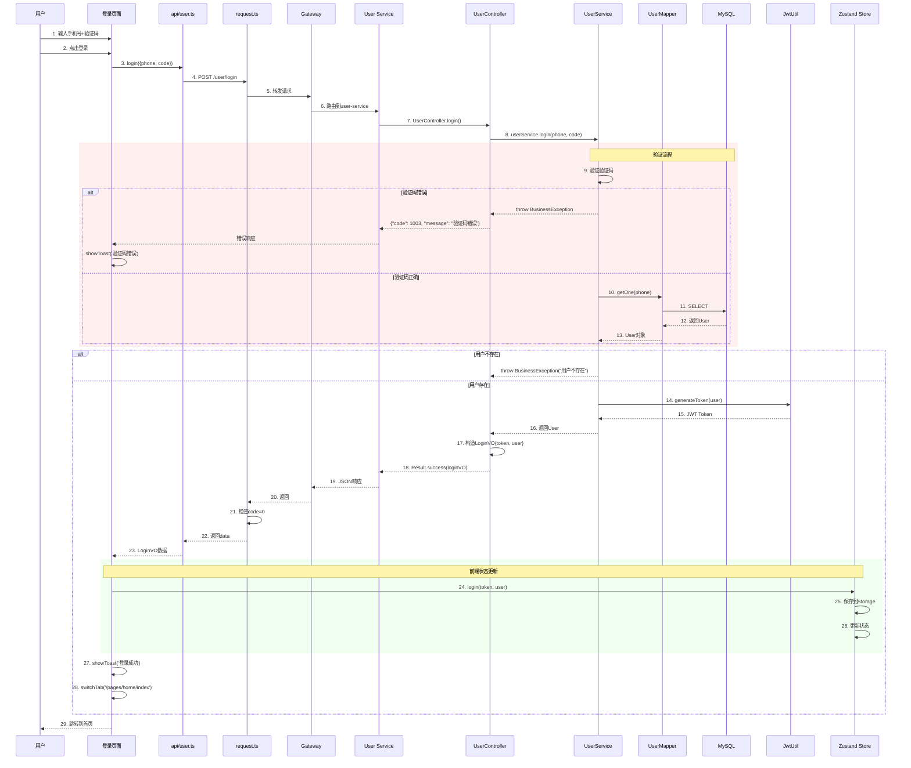
```mermaid
sequenceDiagram
    participant U as 用户
    participant P as 登录页面
    participant A as api/user.ts
    participant R as request.ts
    participant G as Gateway
    participant US as User Service
    participant C as UserController
    participant SV as UserService
    participant M as UserMapper
    participant DB as MySQL
    participant JU as JwtUtil
    participant ST as Zustand Store
    
    U->>P: 1. 输入手机号+验证码
    U->>P: 2. 点击登录
    P->>A: 3. login({phone, code})
    A->>R: 4. POST /user/login
    R->>G: 5. 转发请求
    G->>US: 6. 路由到user-service
    US->>C: 7. UserController.login()
    C->>SV: 8. userService.login(phone, code)
    
    rect rgb(255, 240, 240)
        Note over SV,DB: 验证流程
        SV->>SV: 9. 验证验证码
        alt 验证码错误
            SV-->>C: throw BusinessException
            C-->>US: {"code": 1003, "message": "验证码错误"}
            US-->>P: 错误响应
            P->>P: showToast('验证码错误')
        else 验证码正确
            SV->>M: 10. getOne(phone)
            M->>DB: 11. SELECT
            DB-->>M: 12. 返回User
            M-->>SV: 13. User对象
        end
    end
    
    alt 用户不存在
        SV-->>C: throw BusinessException("用户不存在")
    else 用户存在
        SV->>JU: 14. generateToken(user)
        JU-->>SV: 15. JWT Token
        SV-->>C: 16. 返回User
        C->>C: 17. 构造LoginVO{token, user}
        C-->>US: 18. Result.success(loginVO)
        US-->>G: 19. JSON响应
        G-->>R: 20. 返回
        R->>R: 21. 检查code=0
        R-->>A: 22. 返回data
        A-->>P: 23. LoginVO数据
        
        rect rgb(240, 255, 240)
            Note over P,ST: 前端状态更新
            P->>ST: 24. login(token, user)
            ST->>ST: 25. 保存到Storage
            ST->>ST: 26. 更新状态
        end
        
        P->>P: 27. showToast('登录成功')
        P->>P: 28. switchTab('/pages/home/index')
    end
    
    P-->>U: 29. 跳转到首页
```

**关键数据流：**

```typescript
// 1. 前端发送
{
  "phone": "13800138000",
  "code": "1234"
}

// 2. 后端返回
{
  "code": 0,
  "message": "success",
  "data": {
    "token": "eyJhbGciOiJIUzI1NiIsInR5cCI6IkpXVCJ9...",
    "user": {
      "id": 1,
      "phone": "13800138000",
      "nickName": "张师傅",
      "role": "USER"
    }
  }
}

// 3. 前端存储
Storage.set('AUTH_TOKEN', token)
Store.setState({ token, userInfo, isLogin: true })
```

---

## 任务功能链路

### 3. 任务列表查询

**完整调用链路：**

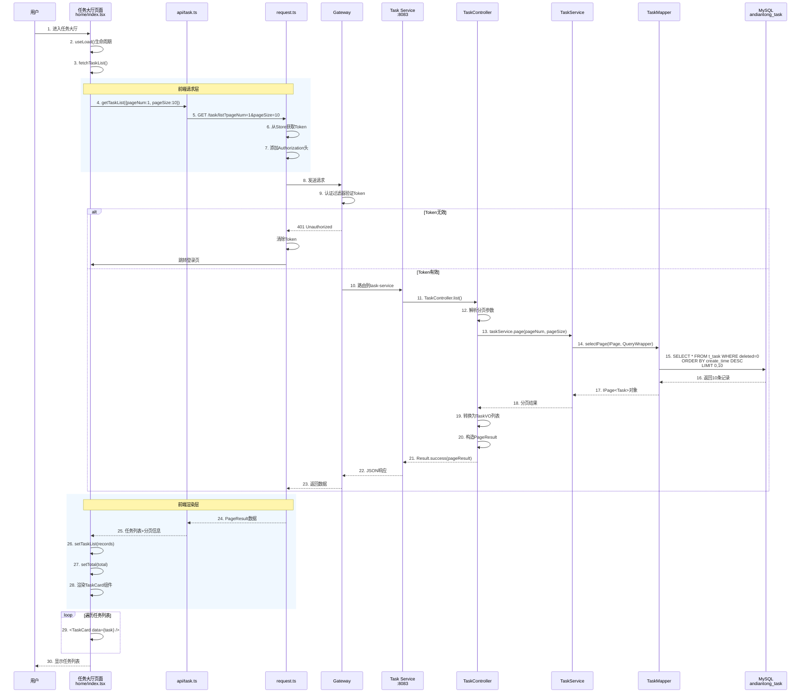
```mermaid
sequenceDiagram
    participant U as 用户
    participant P as 任务大厅页面<br/>home/index.tsx
    participant A as api/task.ts
    participant R as request.ts
    participant G as Gateway
    participant TS as Task Service<br/>:8083
    participant C as TaskController
    participant SV as TaskService
    participant M as TaskMapper
    participant DB as MySQL<br/>andiantong_task
    
    U->>P: 1. 进入任务大厅
    P->>P: 2. useLoad()生命周期
    P->>P: 3. fetchTaskList()
    
    rect rgb(240, 248, 255)
        Note over P,R: 前端请求层
        P->>A: 4. getTaskList({pageNum:1, pageSize:10})
        A->>R: 5. GET /task/list?pageNum=1&pageSize=10
        R->>R: 6. 从Store获取Token
        R->>R: 7. 添加Authorization头
    end
    
    R->>G: 8. 发送请求
    G->>G: 9. 认证过滤器验证Token
    
    alt Token无效
        G-->>R: 401 Unauthorized
        R->>R: 清除Token
        R->>P: 跳转登录页
    else Token有效
        G->>TS: 10. 路由到task-service
        TS->>C: 11. TaskController.list()
        C->>C: 12. 解析分页参数
        C->>SV: 13. taskService.page(pageNum, pageSize)
        SV->>M: 14. selectPage(IPage, QueryWrapper)
        M->>DB: 15. SELECT * FROM t_task WHERE deleted=0<br/>ORDER BY create_time DESC<br/>LIMIT 0,10
        DB-->>M: 16. 返回10条记录
        M-->>SV: 17. IPage<Task>对象
        SV-->>C: 18. 分页结果
        C->>C: 19. 转换为TaskVO列表
        C->>C: 20. 构造PageResult
        C-->>TS: 21. Result.success(pageResult)
        TS-->>G: 22. JSON响应
        G-->>R: 23. 返回数据
    end
    
    rect rgb(240, 248, 255)
        Note over R,P: 前端渲染层
        R-->>A: 24. PageResult数据
        A-->>P: 25. 任务列表+分页信息
        P->>P: 26. setTaskList(records)
        P->>P: 27. setTotal(total)
        P->>P: 28. 渲染TaskCard组件
    end
    
    loop 遍历任务列表
        P->>P: 29. <TaskCard data={task} />
    end
    
    P-->>U: 30. 显示任务列表
```

**返回数据结构：**

```json
{
  "code": 0,
  "message": "success",
  "data": {
    "records": [
      {
        "id": 1,
        "title": "电路故障维修",
        "reward": 100.00,
        "status": "PENDING",
        "publisherName": "李女士",
        "createTime": "2026-01-27 10:00:00"
      }
    ],
    "total": 50,
    "pageNum": 1,
    "pageSize": 10,
    "pages": 5
  }
}
```

---

### 4. 任务发布流程

**完整调用链路：**

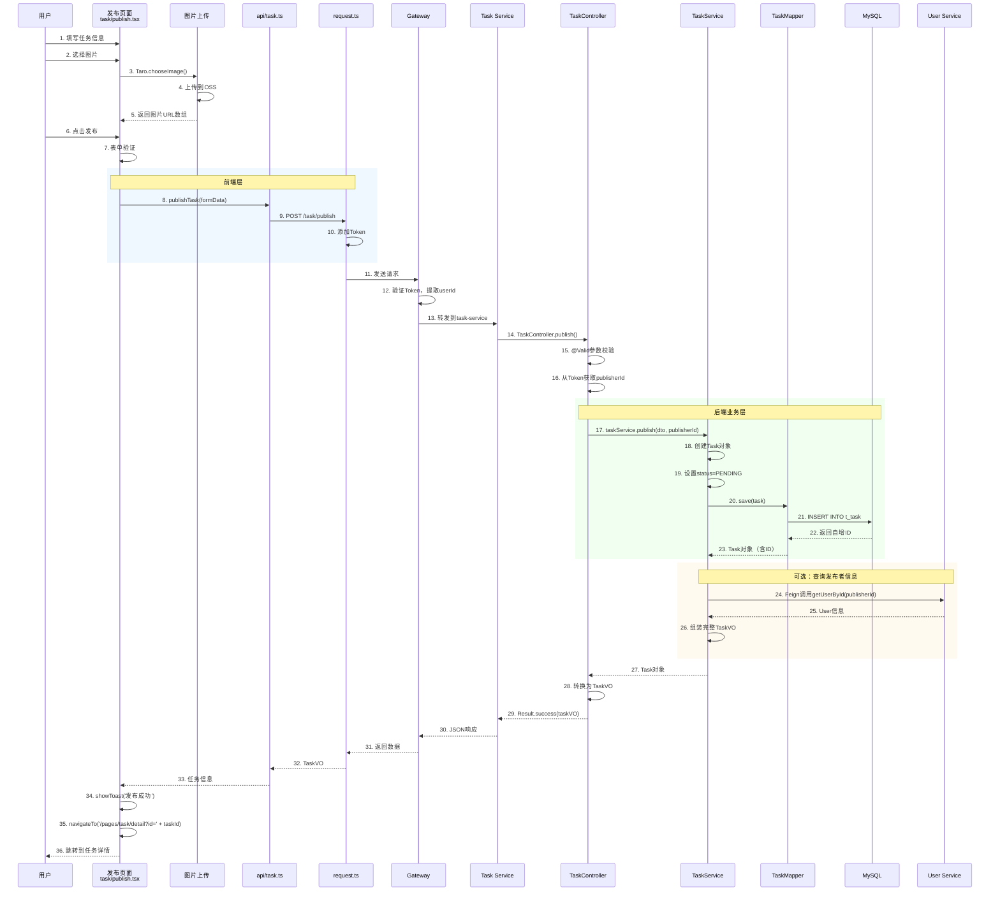
```mermaid
sequenceDiagram
    participant U as 用户
    participant P as 发布页面<br/>task/publish.tsx
    participant UP as 图片上传
    participant A as api/task.ts
    participant R as request.ts
    participant G as Gateway
    participant TS as Task Service
    participant C as TaskController
    participant SV as TaskService
    participant M as TaskMapper
    participant DB as MySQL
    participant US as User Service
    
    U->>P: 1. 填写任务信息
    U->>P: 2. 选择图片
    P->>UP: 3. Taro.chooseImage()
    UP->>UP: 4. 上传到OSS
    UP-->>P: 5. 返回图片URL数组
    
    U->>P: 6. 点击发布
    P->>P: 7. 表单验证
    
    rect rgb(240, 248, 255)
        Note over P,R: 前端层
        P->>A: 8. publishTask(formData)
        A->>R: 9. POST /task/publish
        R->>R: 10. 添加Token
    end
    
    R->>G: 11. 发送请求
    G->>G: 12. 验证Token，提取userId
    G->>TS: 13. 转发到task-service
    TS->>C: 14. TaskController.publish()
    C->>C: 15. @Valid参数校验
    C->>C: 16. 从Token获取publisherId
    
    rect rgb(240, 255, 240)
        Note over C,DB: 后端业务层
        C->>SV: 17. taskService.publish(dto, publisherId)
        SV->>SV: 18. 创建Task对象
        SV->>SV: 19. 设置status=PENDING
        SV->>M: 20. save(task)
        M->>DB: 21. INSERT INTO t_task
        DB-->>M: 22. 返回自增ID
        M-->>SV: 23. Task对象（含ID）
    end
    
    rect rgb(255, 250, 240)
        Note over SV,US: 可选：查询发布者信息
        SV->>US: 24. Feign调用getUserById(publisherId)
        US-->>SV: 25. User信息
        SV->>SV: 26. 组装完整TaskVO
    end
    
    SV-->>C: 27. Task对象
    C->>C: 28. 转换为TaskVO
    C-->>TS: 29. Result.success(taskVO)
    TS-->>G: 30. JSON响应
    G-->>R: 31. 返回数据
    R-->>A: 32. TaskVO
    A-->>P: 33. 任务信息
    
    P->>P: 34. showToast('发布成功')
    P->>P: 35. navigateTo('/pages/task/detail?id=' + taskId)
    P-->>U: 36. 跳转到任务详情
```

**关键代码：**

```typescript
// 前端 - publishTask
const publishTask = async () => {
  const formData = {
    title: title.value,
    description: desc.value,
    reward: parseFloat(reward.value),
    address: address.value,
    images: imageUrls
  }
  
  try {
    const result = await api.publishTask(formData)
    Taro.showToast({ title: '发布成功' })
    Taro.redirectTo({ url: `/pages/task/detail?id=${result.id}` })
  } catch (error) {
    // 错误已在request中处理
  }
}
```

```java
// 后端 - TaskController.publish
@PostMapping("/publish")
public Result<TaskVO> publish(@RequestBody @Valid PublishTaskDTO dto,
                               @RequestHeader("Authorization") String token) {
    Long publisherId = JwtUtil.getUserId(token);
    Task task = taskService.publish(dto, publisherId);
    return Result.success(convertToVO(task));
}
```

---

### 5. 任务接单流程

**完整调用链路：**

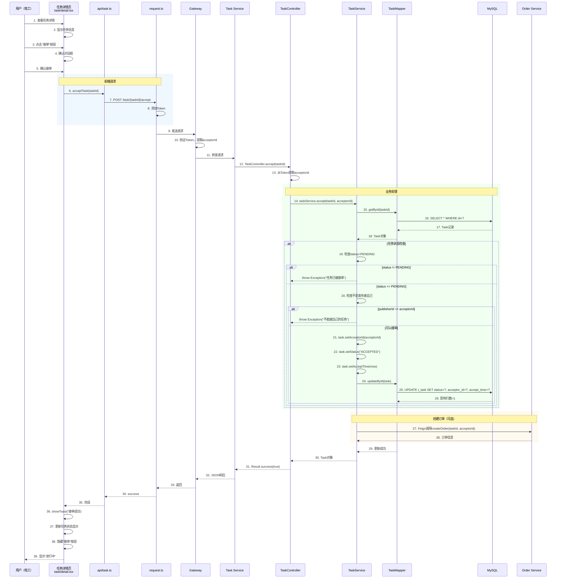
```mermaid
sequenceDiagram
    participant U as 用户（电工）
    participant D as 任务详情页<br/>task/detail.tsx
    participant A as api/task.ts
    participant R as request.ts
    participant G as Gateway
    participant TS as Task Service
    participant C as TaskController
    participant SV as TaskService
    participant M as TaskMapper
    participant DB as MySQL
    participant OS as Order Service
    
    U->>D: 1. 查看任务详情
    D->>D: 2. 显示任务信息
    U->>D: 3. 点击"接单"按钮
    
    D->>D: 4. 确认对话框
    U->>D: 5. 确认接单
    
    rect rgb(240, 248, 255)
        Note over D,R: 前端请求
        D->>A: 6. acceptTask(taskId)
        A->>R: 7. POST /task/{taskId}/accept
        R->>R: 8. 添加Token
    end
    
    R->>G: 9. 发送请求
    G->>G: 10. 验证Token，提取acceptorId
    G->>TS: 11. 转发请求
    TS->>C: 12. TaskController.accept(taskId)
    C->>C: 13. 从Token获取acceptorId
    
    rect rgb(240, 255, 240)
        Note over C,DB: 业务处理
        C->>SV: 14. taskService.accept(taskId, acceptorId)
        SV->>M: 15. getById(taskId)
        M->>DB: 16. SELECT * WHERE id=?
        DB-->>M: 17. Task记录
        M-->>SV: 18. Task对象
        
        alt 任务状态检查
            SV->>SV: 19. 检查status=PENDING
            alt status != PENDING
                SV-->>C: throw Exception("任务已被接单")
            else status == PENDING
                SV->>SV: 20. 检查不是发布者自己
                alt publisherId == acceptorId
                    SV-->>C: throw Exception("不能接自己的任务")
                else 可以接单
                    SV->>SV: 21. task.setAcceptorId(acceptorId)
                    SV->>SV: 22. task.setStatus("ACCEPTED")
                    SV->>SV: 23. task.setAcceptTime(now)
                    SV->>M: 24. updateById(task)
                    M->>DB: 25. UPDATE t_task SET status=?, acceptor_id=?, accept_time=?
                    DB-->>M: 26. 影响行数=1
                end
            end
        end
    end
    
    rect rgb(255, 250, 240)
        Note over SV,OS: 创建订单（可选）
        SV->>OS: 27. Feign调用createOrder(taskId, acceptorId)
        OS-->>SV: 28. 订单信息
    end
    
    M-->>SV: 29. 更新成功
    SV-->>C: 30. Task对象
    C-->>TS: 31. Result.success(true)
    TS-->>G: 32. JSON响应
    G-->>R: 33. 返回
    R-->>A: 34. success
    A-->>D: 35. 完成
    
    D->>D: 36. showToast('接单成功')
    D->>D: 37. 更新任务状态显示
    D->>D: 38. 隐藏"接单"按钮
    D-->>U: 39. 显示"进行中"
```

**数据库更新：**

```sql
-- 接单前
SELECT * FROM t_task WHERE id = 1;
-- id=1, status='PENDING', acceptor_id=NULL

-- 接单操作
UPDATE t_task 
SET status = 'ACCEPTED',
    acceptor_id = 5,
    accept_time = '2026-01-27 10:30:00'
WHERE id = 1 AND status = 'PENDING';

-- 接单后
SELECT * FROM t_task WHERE id = 1;
-- id=1, status='ACCEPTED', acceptor_id=5
```

---

### 7. AI智能诊断（电路急修）

**完整调用链路：**

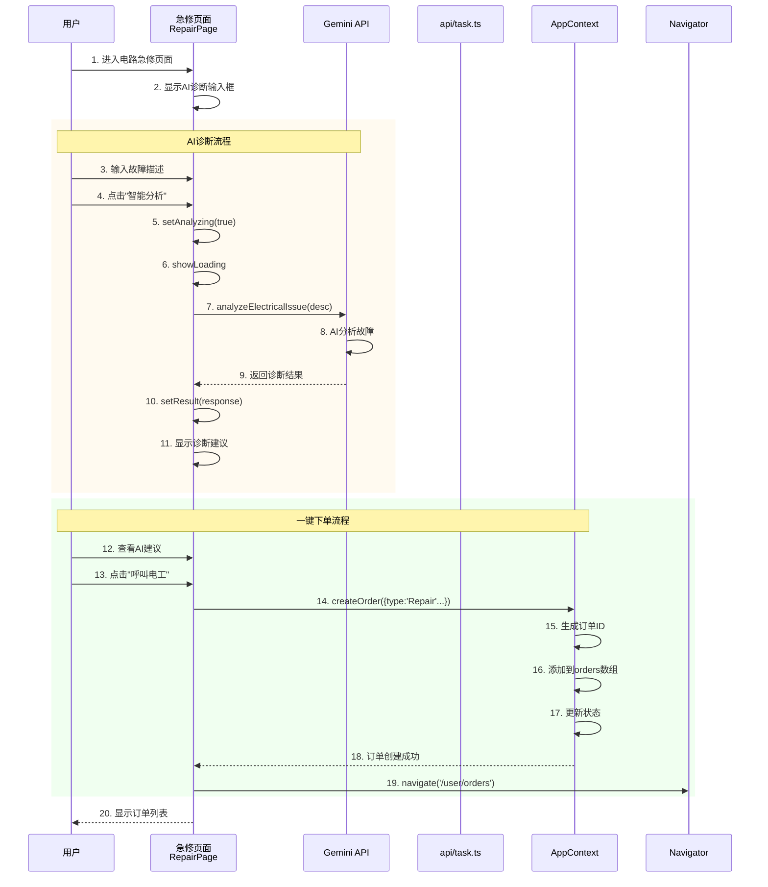
```mermaid
sequenceDiagram
    participant U as 用户
    participant P as 急修页面<br/>RepairPage
    participant G as Gemini API
    participant A as api/task.ts
    participant C as AppContext
    participant N as Navigator
    
    U->>P: 1. 进入电路急修页面
    P->>P: 2. 显示AI诊断输入框
    
    rect rgb(255, 250, 240)
        Note over U,G: AI诊断流程
        U->>P: 3. 输入故障描述
        U->>P: 4. 点击"智能分析"
        P->>P: 5. setAnalyzing(true)
        P->>P: 6. showLoading
        P->>G: 7. analyzeElectricalIssue(desc)
        G->>G: 8. AI分析故障
        G-->>P: 9. 返回诊断结果
        P->>P: 10. setResult(response)
        P->>P: 11. 显示诊断建议
    end
    
    rect rgb(240, 255, 240)
        Note over U,C: 一键下单流程  
        U->>P: 12. 查看AI建议
        U->>P: 13. 点击"呼叫电工"
        P->>C: 14. createOrder({type:'Repair'...})
        C->>C: 15. 生成订单ID
        C->>C: 16. 添加到orders数组
        C->>C: 17. 更新状态
        C-->>P: 18. 订单创建成功
        P->>N: 19. navigate('/user/orders')
    end
    
    P-->>U: 20. 显示订单列表
```

**关键代码位置：**
- 前端页面：`pages/user/UserFunctions.tsx` - `RepairPage`
- AI服务：`services/geminiService.ts` - `analyzeElectricalIssue()`
- 状态管理：`context/AppContext.tsx` - `createOrder()`

**数据流：**
```typescript
// 1. 用户输入
{
  description: "厨房插座冒火花"
}

// 2. AI分析（Gemini API）
{
  diagnosis: "可能是插座接触不良或内部短路",
  urgency: "high",
  suggestion: "立即停止使用，建议专业电工上门检查"
}

// 3. 创建订单
{
  type: "Repair",
  title: "极速报修",
  description: "厨房插座冒火花",
  status: "PENDING",
  priceEstimate: {min: 30, max: 80}
}
```


---

### 8. 一键上门检测 (智能状态流转)

> **对应组件**: `pages/user/services/InspectionFlow.tsx`
> **核心特性**: 完整模拟了从"预约"到"完成"的8个状态流转，前端目前使用定时器模拟，**接入后端时需注意WebSocket推送与服务端状态机**。

**完整调用链路：**

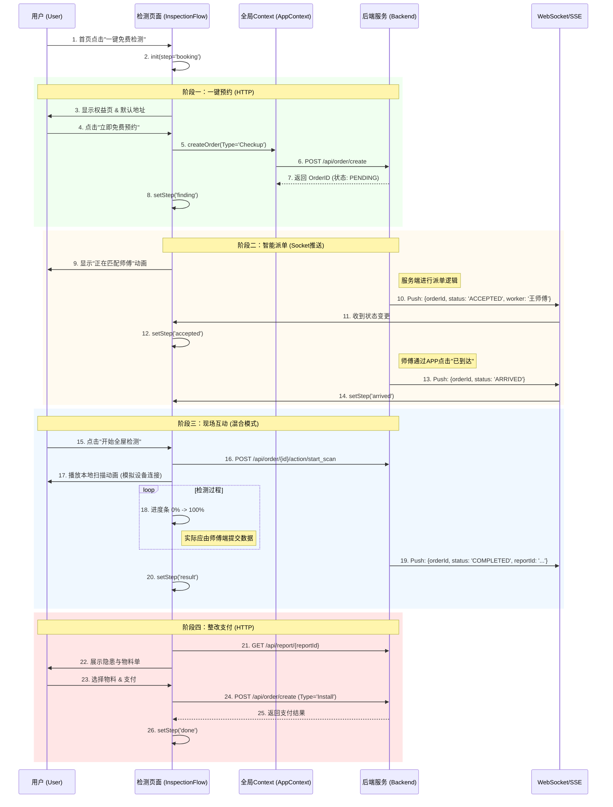
```mermaid
sequenceDiagram
    participant U as 用户 (User)
    participant P as 检测页面 (InspectionFlow)
    participant C as 全局Context (AppContext)
    participant S as 后端服务 (Backend)
    participant W as WebSocket/SSE

    U->>P: 1. 首页点击"一键免费检测"
    P->>P: 2. init(step='booking')
    
    rect rgb(240, 255, 240)
        Note over U,S: 阶段一：一键预约 (HTTP)
        P->>U: 3. 显示权益页 & 默认地址
        U->>P: 4. 点击"立即免费预约"
        P->>C: 5. createOrder(Type='Checkup')
        C->>S: 6. POST /api/order/create
        S-->>C: 7. 返回 OrderID (状态: PENDING)
        P->>P: 8. setStep('finding')
    end

    rect rgb(255, 250, 240)
        Note over S,P: 阶段二：智能派单 (Socket推送)
        P->>U: 9. 显示"正在匹配师傅"动画
        Note right of S: 服务端进行派单逻辑
        S->>W: 10. Push: {orderId, status: 'ACCEPTED', worker: '王师傅'}
        W->>P: 11. 收到状态变更
        P->>P: 12. setStep('accepted')
        
        Note right of S: 师傅通过APP点击"已到达"
        S->>W: 13. Push: {orderId, status: 'ARRIVED'}
        W->>P: 14. setStep('arrived')
    end

    rect rgb(240, 248, 255)
        Note over U,S: 阶段三：现场互动 (混合模式)
        U->>P: 15. 点击"开始全屋检测"
        P->>S: 16. POST /api/order/{id}/action/start_scan
        P->>U: 17. 播放本地扫描动画 (模拟设备连接)
        
        loop 检测过程
            P->>P: 18. 进度条 0% -> 100%
            Note right of P: 实际应由师傅端提交数据
        end
        
        S->>W: 19. Push: {orderId, status: 'COMPLETED', reportId: '...'}
        P->>P: 20. setStep('result')
    end

    rect rgb(255, 230, 230)
        Note over U,S: 阶段四：整改支付 (HTTP)
        P->>S: 21. GET /api/report/{reportId}
        P->>U: 22. 展示隐患与物料单
        U->>P: 23. 选择物料 & 支付
        P->>S: 24. POST /api/order/create (Type='Install')
        S-->>P: 25. 返回支付结果
        P->>P: 26. setStep('done')
    end
```

**后端接口准备 (Backend Integration)：**

在此功能的真实开发中，后端需要提供以下具体支持：

| 步骤 | 接口/机制 | 作用 | 参数示例 |
| :--- | :--- | :--- | :--- |
| **派单** | `POST /api/dispatch/auto` | 触发智能派单算法，匹配附近电工 | `{orderId: "123", loc: {lat, lng}}` |
| **推送** | `WebSocket` / `SSE` | **关键**：向用户端实时推送订单状态变更 (接单、到达、完成) | Event: `ORDER_UPDATE` <br/> Payload: `{status: "ARRIVED"}` |
| **动作** | `POST /api/order/{id}/timeline` | 记录关键节点 (如用户点击开始检测)，用于审计 | `{action: "USER_START_SCAN"}` |
| **报告** | `GET /api/report/{id}` | 获取详细的检测报告数据（评分、隐患项、建议） | Response: `{score: 78, issues: [...]}` |
| **物料** | `GET /api/product/materials` | 获取当前可用的整改物料清单及价格 | Response: `[{id: 1, name: "漏保", price: 85}]` |

> **注意**：目前前端 `InspectionFlow.tsx` 使用 `setTimeout` 模拟了 Socket 推送过程。对接时，需将 `useEffect` 中的定时器逻辑替换为 `useWebSocket` 或轮询逻辑。

---

### 9. 深度体检预约流程

**完整调用链路：**

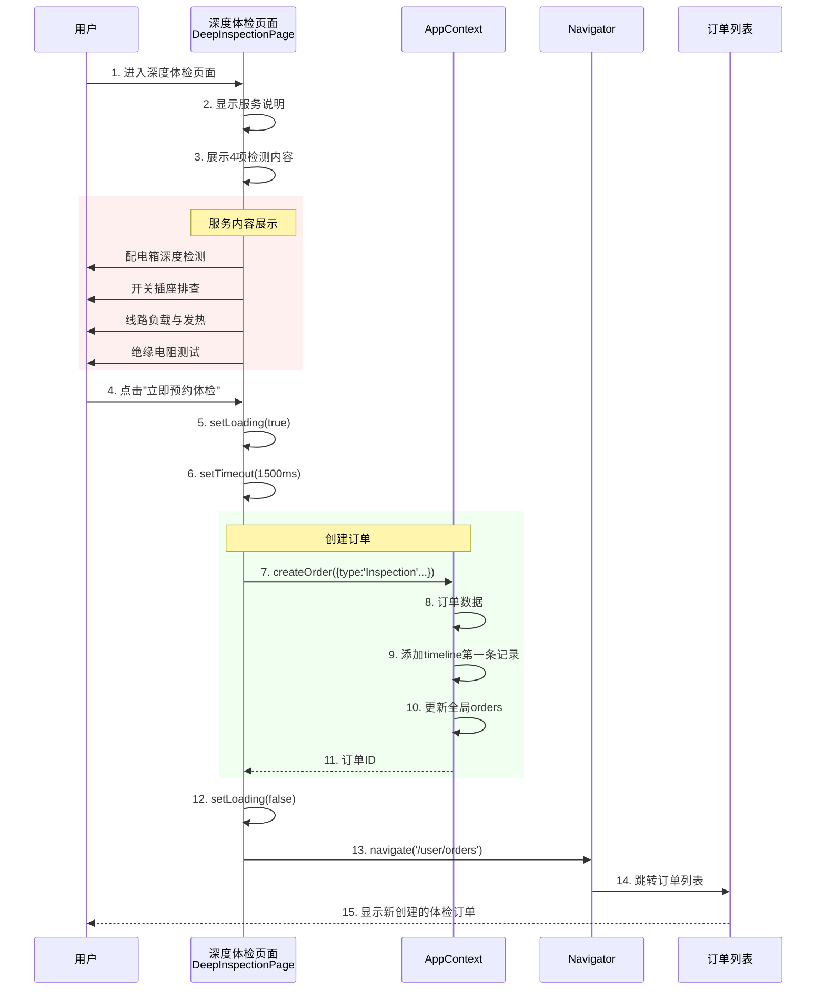
```mermaid
sequenceDiagram
    participant U as 用户
    participant P as 深度体检页面<br/>DeepInspectionPage
    participant C as AppContext
    participant N as Navigator
    participant O as 订单列表
    
    U->>P: 1. 进入深度体检页面
    P->>P: 2. 显示服务说明
    P->>P: 3. 展示4项检测内容
    
    rect rgb(255, 240, 240)
        Note over P: 服务内容展示
        P->>U: 配电箱深度检测
        P->>U: 开关插座排查
        P->>U: 线路负载与发热
        P->>U: 绝缘电阻测试
    end
    
    U->>P: 4. 点击"立即预约体检"
    P->>P: 5. setLoading(true)
    P->>P: 6. setTimeout(1500ms)
    
    rect rgb(240, 255, 240)
        Note over P,C: 创建订单
        P->>C: 7. createOrder({type:'Inspection'...})
        C->>C: 8. 订单数据
        C->>C: 9. 添加timeline第一条记录
        C->>C: 10. 更新全局orders
        C-->>P: 11. 订单ID
    end
    
    P->>P: 12. setLoading(false)
    P->>N: 13. navigate('/user/orders')
    N->>O: 14. 跳转订单列表
    O-->>U: 15. 显示新创建的体检订单
```

**订单数据结构：**
```json
{
  "id": "order_xxx",
  "type": "Inspection",
  "title": "全屋深度电路体检",
  "description": "服务包含：总配电箱检测、全屋开关插座排查、大功率电器负载测试、线路绝缘性检测。",
  "priceEstimate": {
    "min": 199,
    "max": 299
  },
  "scheduledTime": "待协商",
  "status": "PENDING"
}
```

---

### 10. 上门安装（含材料选购）

**完整调用链路：**

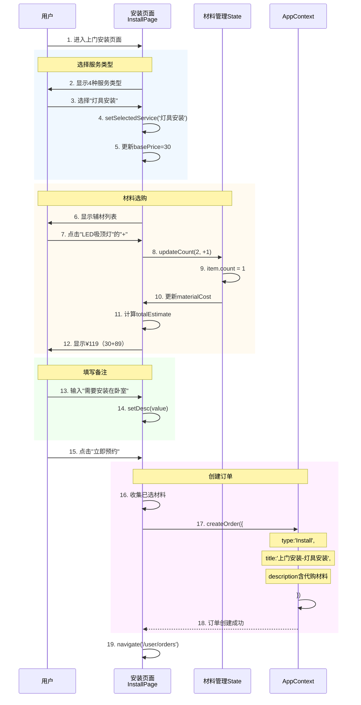
```mermaid
sequenceDiagram
    participant U as 用户
    participant P as 安装页面<br/>InstallPage
    participant M as 材料管理State
    participant C as AppContext
    
    U->>P: 1. 进入上门安装页面
    
    rect rgb(240, 248, 255)
        Note over U,P: 选择服务类型
        P->>U: 2. 显示4种服务类型
        U->>P: 3. 选择"灯具安装"
        P->>P: 4. setSelectedService('灯具安装')
        P->>P: 5. 更新basePrice=30
    end
    
    rect rgb(255, 250, 240)
        Note over U,M: 材料选购
        P->>U: 6. 显示辅材列表
        U->>P: 7. 点击"LED吸顶灯"的"+"
        P->>M: 8. updateCount(2, +1)
        M->>M: 9. item.count = 1
        M->>P: 10. 更新materialCost
        P->>P: 11. 计算totalEstimate
        P->>U: 12. 显示¥119（30+89）
    end
    
    rect rgb(240, 255, 240)
        Note over U,P: 填写备注
        U->>P: 13. 输入"需要安装在卧室"
        P->>P: 14. setDesc(value)
    end
    
    U->>P: 15. 点击"立即预约"
    
    rect rgb(255, 240, 255)
        Note over P,C: 创建订单
        P->>P: 16. 收集已选材料
        P->>C: 17. createOrder({
        Note over C: type:'Install',
        Note over C: title:'上门安装-灯具安装',
        Note over C: description含代购材料
        C->>C: })
        C-->>P: 18. 订单创建成功
    end
    
    P->>P: 19. navigate('/user/orders')
```

**关键逻辑：**

```typescript
// 材料计数更新
const updateCount = (id: number, delta: number) => {
  setMaterials(prev => prev.map(item => {
    if (item.id === id) {
      return { ...item, count: Math.max(0, item.count + delta) };
    }
    return item;
  }));
};

// 计算总价
const materialCost = materials.reduce((acc, curr) => 
  acc + (curr.price * curr.count), 0
);
const totalEstimate = currentServicePrice + materialCost;

// 订单描述
const purchased = materials
  .filter(m => m.count > 0)
  .map(m => `${m.name} x${m.count}`)
  .join(', ');

description: desc + (purchased ? `\n[代购材料]: ${purchased}` : '')
```

---

### 11. 公益活动预约

**完整调用链路：**

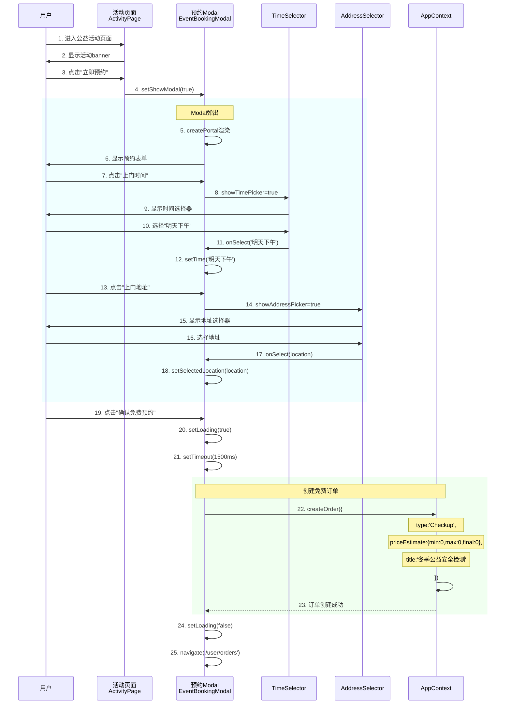
```mermaid
sequenceDiagram
    participant U as 用户
    participant A as 活动页面<br/>ActivityPage
    participant M as 预约Modal<br/>EventBookingModal
    participant TS as TimeSelector
    participant AS as AddressSelector
    participant C as AppContext
    
    U->>A: 1. 进入公益活动页面
    A->>U: 2. 显示活动banner
    U->>A: 3. 点击"立即预约"
    A->>M: 4. setShowModal(true)
    
    rect rgb(240, 255, 255)
        Note over M: Modal弹出
        M->>M: 5. createPortal渲染
        M->>U: 6. 显示预约表单
        
        U->>M: 7. 点击"上门时间"
        M->>TS: 8. showTimePicker=true
        TS->>U: 9. 显示时间选择器
        U->>TS: 10. 选择"明天下午"
        TS->>M: 11. onSelect('明天下午')
        M->>M: 12. setTime('明天下午')
        
        U->>M: 13. 点击"上门地址"
        M->>AS: 14. showAddressPicker=true
        AS->>U: 15. 显示地址选择器
        U->>AS: 16. 选择地址
        AS->>M: 17. onSelect(location)
        M->>M: 18. setSelectedLocation(location)
    end
    
    U->>M: 19. 点击"确认免费预约"
    M->>M: 20. setLoading(true)
    M->>M: 21. setTimeout(1500ms)
    
    rect rgb(240, 255, 240)
        Note over M,C: 创建免费订单
        M->>C: 22. createOrder({
        Note over C: type:'Checkup',
        Note over C: priceEstimate:{min:0,max:0,final:0},
        Note over C: title:'冬季公益安全检测'
        C->>C: })
        C-->>M: 23. 订单创建成功
    end
    
    M->>M: 24. setLoading(false)
    M->>M: 25. navigate('/user/orders')
```

**特殊数据：**
```json
{
  "type": "Checkup",
  "title": "冬季公益安全检测",
  "priceEstimate": {
    "min": 0,
    "max": 0,
    "final": 0
  },
  "description": "预约项目：冬季用电安全月公益检测（老旧线路、取暖设备、漏电保护）"
}
```

---

### 12. 电工抢单流程

**完整调用链路：**

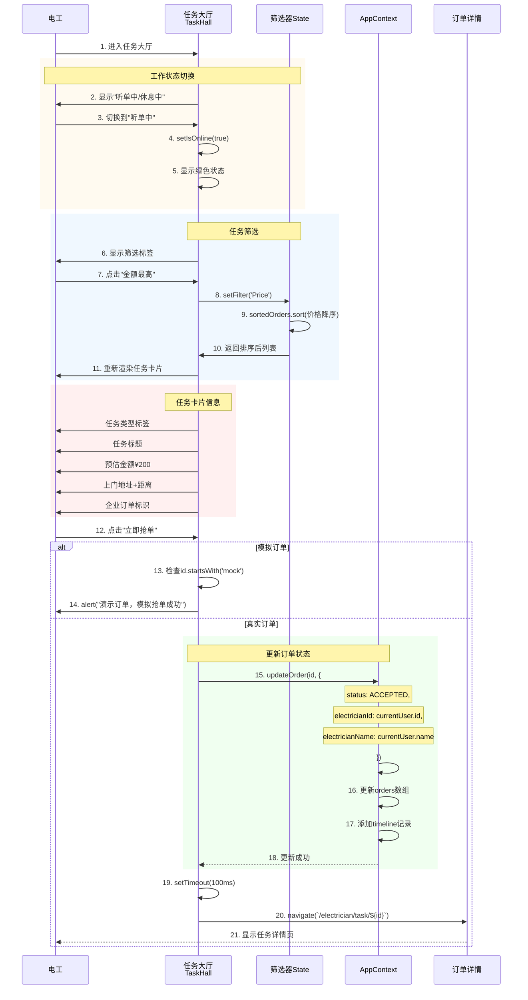
```mermaid
sequenceDiagram
    participant E as 电工
    participant H as 任务大厅<br/>TaskHall
    participant F as 筛选器State
    participant C as AppContext
    participant D as 订单详情
    
    E->>H: 1. 进入任务大厅
    
    rect rgb(255, 250, 240)
        Note over E,F: 工作状态切换
        H->>E: 2. 显示"听单中/休息中"
        E->>H: 3. 切换到"听单中"
        H->>H: 4. setIsOnline(true)
        H->>H: 5. 显示绿色状态
    end
    
    rect rgb(240, 248, 255)
        Note over H,F: 任务筛选
        H->>E: 6. 显示筛选标签
        E->>H: 7. 点击"金额最高"
        H->>F: 8. setFilter('Price')
        F->>F: 9. sortedOrders.sort(价格降序)
        F->>H: 10. 返回排序后列表
        H->>E: 11. 重新渲染任务卡片
    end
    
    rect rgb(255, 240, 240)
        Note over H: 任务卡片信息
        H->>E: 任务类型标签
        H->>E: 任务标题
        H->>E: 预估金额¥200
        H->>E: 上门地址+距离
        H->>E: 企业订单标识
    end
    
    E->>H: 12. 点击"立即抢单"
    
    alt 模拟订单
        H->>H: 13. 检查id.startsWith('mock')
        H->>E: 14. alert("演示订单，模拟抢单成功")
    else 真实订单
        rect rgb(240, 255, 240)
            Note over H,C: 更新订单状态
            H->>C: 15. updateOrder(id, {
            Note over C: status: ACCEPTED,
            Note over C: electricianId: currentUser.id,
            Note over C: electricianName: currentUser.name
            C->>C: })
            C->>C: 16. 更新orders数组
            C->>C: 17. 添加timeline记录
            C-->>H: 18. 更新成功
        end
        
        H->>H: 19. setTimeout(100ms)
        H->>D: 20. navigate(`/electrician/task/${id}`)
        D-->>E: 21. 显示任务详情页
    end
```

**任务筛选逻辑：**

```typescript
// 筛选逻辑
const sortedOrders = [...allOrders].sort((a, b) => {
  if (filter === 'Price') {
    return b.priceEstimate.min - a.priceEstimate.min; // 降序
  }
  if (filter === 'Distance') {
    // 实际应该计算距离
    return 0;
  }
  return 0; // Recommend - 保持原顺序
});

// 抢单逻辑
const handleGrab = (id: string) => {
  const isMock = id.startsWith('mock');
  if (isMock) {
    alert("演示订单，模拟抢单成功");
    return;
  }
  
  updateOrder(id, { 
    status: OrderStatus.ACCEPTED, 
    electricianId: currentUser?.id,
    electricianName: currentUser?.name 
  });
  
  setTimeout(() => navigate(`/electrician/task/${id}`), 100);
};
```

---

### 13. 预约指定电工

**完整调用链路：**

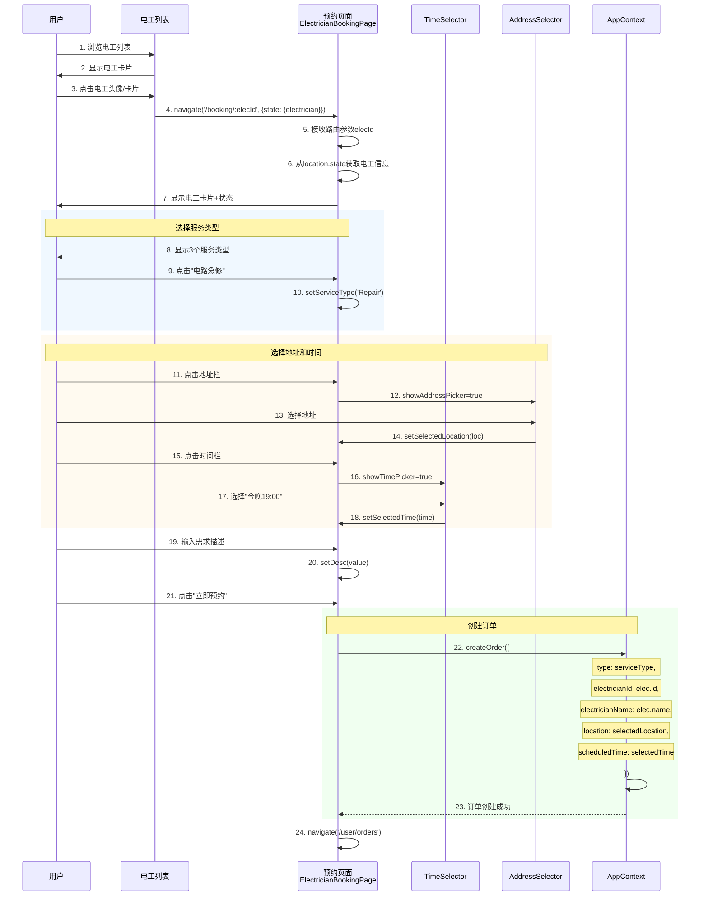
```mermaid
sequenceDiagram
    participant U as 用户
    participant L as 电工列表
    participant B as 预约页面<br/>ElectricianBookingPage
    participant TS as TimeSelector
    participant AS as AddressSelector
    participant C as AppContext
    
    U->>L: 1. 浏览电工列表
    L->>U: 2. 显示电工卡片
    U->>L: 3. 点击电工头像/卡片
    L->>B: 4. navigate('/booking/:elecId', {state: {electrician}})
    
    B->>B: 5. 接收路由参数elecId
    B->>B: 6. 从location.state获取电工信息
    B->>U: 7. 显示电工卡片+状态
    
    rect rgb(240, 248, 255)
        Note over U,B: 选择服务类型
        B->>U: 8. 显示3个服务类型
        U->>B: 9. 点击"电路急修"
        B->>B: 10. setServiceType('Repair')
    end
    
    rect rgb(255, 250, 240)
        Note over U,AS: 选择地址和时间
        U->>B: 11. 点击地址栏
        B->>AS: 12. showAddressPicker=true
        U->>AS: 13. 选择地址
        AS->>B: 14. setSelectedLocation(loc)
        
        U->>B: 15. 点击时间栏
        B->>TS: 16. showTimePicker=true
        U->>TS: 17. 选择"今晚19:00"
        TS->>B: 18. setSelectedTime(time)
    end
    
    U->>B: 19. 输入需求描述
    B->>B: 20. setDesc(value)
    
    U->>B: 21. 点击"立即预约"
    
    rect rgb(240, 255, 240)
        Note over B,C: 创建订单
        B->>C: 22. createOrder({
        Note over C: type: serviceType,
        Note over C: electricianId: elec.id,
        Note over C: electricianName: elec.name,
        Note over C: location: selectedLocation,
        Note over C: scheduledTime: selectedTime
        C->>C: })
        C-->>B: 23. 订单创建成功
    end
    
    B->>B: 24. navigate('/user/orders')
```

**关键数据流：**

```typescript
// 1. 路由传递电工信息
navigate(`/booking/${elec.id}`, {
  state: { electrician: elec }
});

// 2. 接收电工信息
const { elecId } = useParams();
const location = useLocation();
const elec = location.state?.electrician || fallbackData;

// 3. 创建订单
createOrder({
  type: serviceType,  // 'Repair' | 'Install' | 'Checkup'
  title: `预约服务 - ${elec.name}`,
  description: desc,
  location: selectedLocation,
  scheduledTime: selectedTime,
  electricianId: elec.id,
  electricianName: elec.name,
  priceEstimate: { min: minPrice, max: minPrice + 100 }
});
```

---

## 订单功能链路

### 14. 订单列表查询

**完整调用链路：**

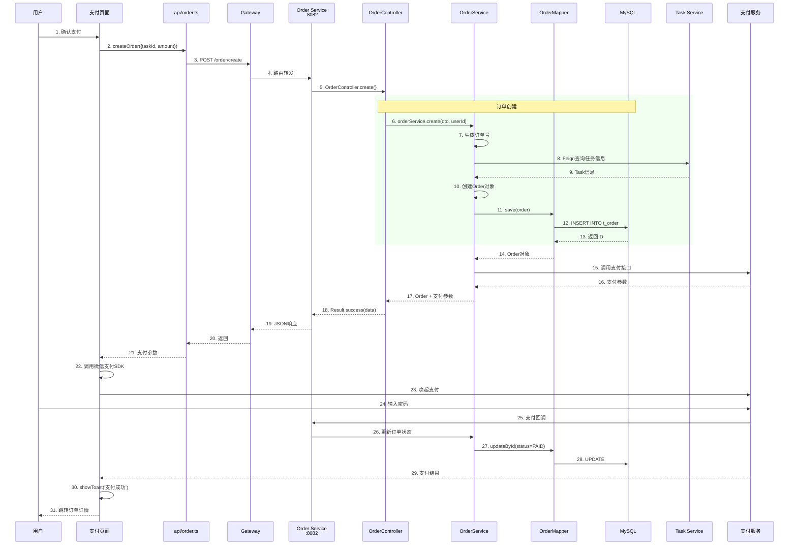
```mermaid
sequenceDiagram
    participant U as 用户
    participant P as 支付页面
    participant A as api/order.ts
    participant G as Gateway
    participant OS as Order Service<br/>:8082
    participant C as OrderController
    participant SV as OrderService
    participant M as OrderMapper
    participant DB as MySQL
    participant TS as Task Service
    participant PS as 支付服务
    
    U->>P: 1. 确认支付
    P->>A: 2. createOrder({taskId, amount})
    A->>G: 3. POST /order/create
    G->>OS: 4. 路由转发
    OS->>C: 5. OrderController.create()
    
    rect rgb(240, 255, 240)
        Note over C,DB: 订单创建
        C->>SV: 6. orderService.create(dto, userId)
        SV->>SV: 7. 生成订单号
        SV->>TS: 8. Feign查询任务信息
        TS-->>SV: 9. Task信息
        SV->>SV: 10. 创建Order对象
        SV->>M: 11. save(order)
        M->>DB: 12. INSERT INTO t_order
        DB-->>M: 13. 返回ID
    end
    
    M-->>SV: 14. Order对象
    SV->>PS: 15. 调用支付接口
    PS-->>SV: 16. 支付参数
    SV-->>C: 17. Order + 支付参数
    C-->>OS: 18. Result.success(data)
    OS-->>G: 19. JSON响应
    G-->>A: 20. 返回
    A-->>P: 21. 支付参数
    
    P->>P: 22. 调用微信支付SDK
    P->>PS: 23. 唤起支付
    U->>PS: 24. 输入密码
    PS->>OS: 25. 支付回调
    OS->>SV: 26. 更新订单状态
    SV->>M: 27. updateById(status=PAID)
    M->>DB: 28. UPDATE
    
    PS-->>P: 29. 支付结果
    P->>P: 30. showToast('支付成功')
    P-->>U: 31. 跳转订单详情
```


---

## 积分与会员链路

### 15. 积分权益兑换流程

**完整调用链路：**

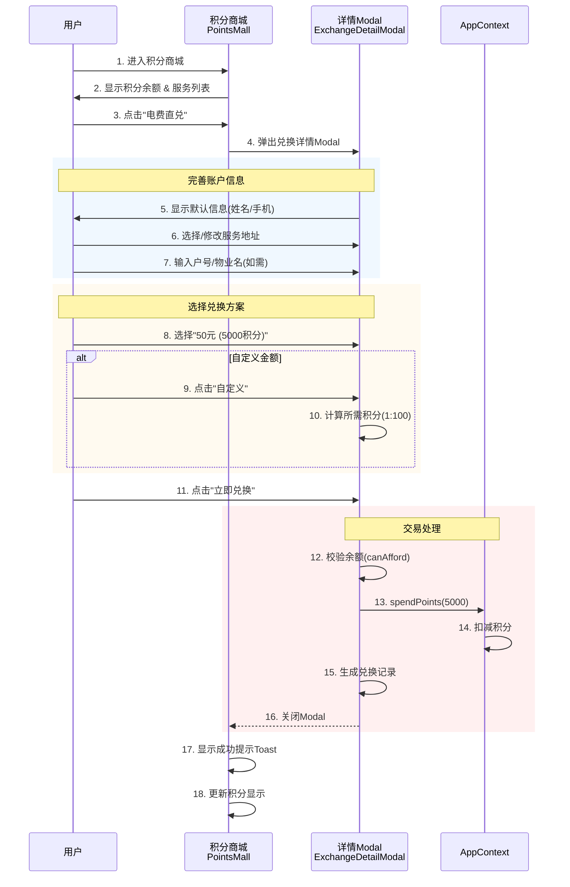
```mermaid
sequenceDiagram
    participant U as 用户
    participant P as 积分商城<br/>PointsMall
    participant D as 详情Modal<br/>ExchangeDetailModal
    participant C as AppContext
    
    U->>P: 1. 进入积分商城
    P->>U: 2. 显示积分余额 & 服务列表
    U->>P: 3. 点击"电费直兑"
    P->>D: 4. 弹出兑换详情Modal
    
    rect rgb(240, 248, 255)
        Note over U,D: 完善账户信息
        D->>U: 5. 显示默认信息(姓名/手机)
        U->>D: 6. 选择/修改服务地址
        U->>D: 7. 输入户号/物业名(如需)
    end
    
    rect rgb(255, 250, 240)
        Note over U,D: 选择兑换方案
        U->>D: 8. 选择"50元 (5000积分)"
        alt 自定义金额
            U->>D: 9. 点击"自定义"
            D->>D: 10. 计算所需积分(1:100)
        end
    end
    
    U->>D: 11. 点击"立即兑换"
    
    rect rgb(255, 240, 240)
        Note over D,C: 交易处理
        D->>D: 12. 校验余额(canAfford)
        D->>C: 13. spendPoints(5000)
        C->>C: 14. 扣减积分
        D->>D: 15. 生成兑换记录
        D-->>P: 16. 关闭Modal
    end
    
    P->>P: 17. 显示成功提示Toast
    P->>P: 18. 更新积分显示
```

---

### 16. 会员购买与升级流程

**完整调用链路：**

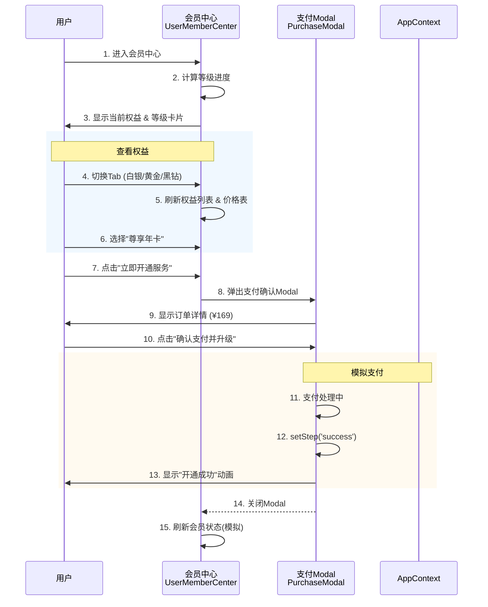
```mermaid
sequenceDiagram
    participant U as 用户
    participant M as 会员中心<br/>UserMemberCenter
    participant P as 支付Modal<br/>PurchaseModal
    participant C as AppContext
    
    U->>M: 1. 进入会员中心
    M->>M: 2. 计算等级进度
    M->>U: 3. 显示当前权益 & 等级卡片
    
    rect rgb(240, 248, 255)
        Note over U,M: 查看权益
        U->>M: 4. 切换Tab (白银/黄金/黑钻)
        M->>M: 5. 刷新权益列表 & 价格表
        U->>M: 6. 选择"尊享年卡"
    end
    
    U->>M: 7. 点击"立即开通服务"
    M->>P: 8. 弹出支付确认Modal
    
    P->>U: 9. 显示订单详情 (¥169)
    U->>P: 10. 点击"确认支付并升级"
    
    rect rgb(255, 250, 240)
        Note over P,C: 模拟支付
        P->>P: 11. 支付处理中
        P->>P: 12. setStep('success')
        P->>U: 13. 显示"开通成功"动画
    end
    
    P-->>M: 14. 关闭Modal
    M->>M: 15. 刷新会员状态(模拟)
```

---

## 履约与互动链路

### 17. 电工订单履约全流程（状态机）

**完整调用链路：**

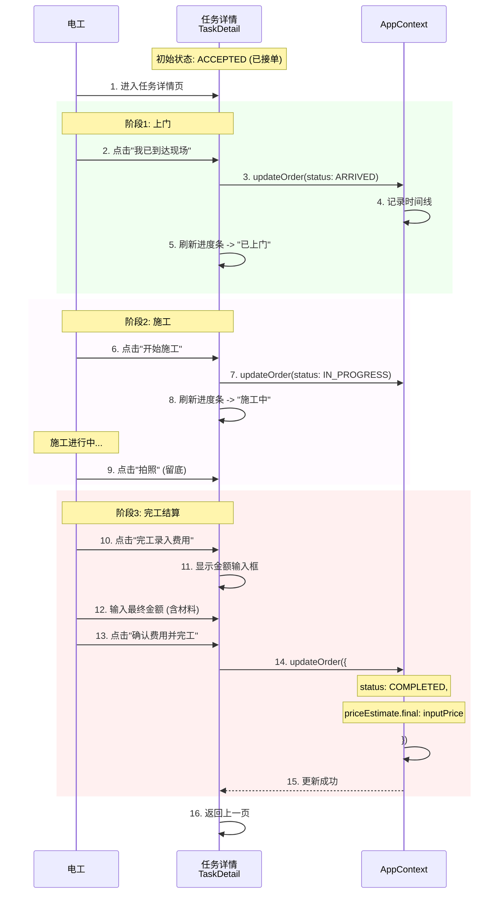
```mermaid
sequenceDiagram
    participant E as 电工
    participant D as 任务详情<br/>TaskDetail
    participant C as AppContext
    
    Note over D: 初始状态: ACCEPTED (已接单)
    
    E->>D: 1. 进入任务详情页
    
    rect rgb(240, 255, 240)
        Note over E,D: 阶段1: 上门
        E->>D: 2. 点击"我已到达现场"
        D->>C: 3. updateOrder(status: ARRIVED)
        C->>C: 4. 记录时间线
        D->>D: 5. 刷新进度条 -> "已上门"
    end
    
    rect rgb(255, 250, 255)
        Note over E,D: 阶段2: 施工
        E->>D: 6. 点击"开始施工"
        D->>C: 7. updateOrder(status: IN_PROGRESS)
        D->>D: 8. 刷新进度条 -> "施工中"
        
        Note over E: 施工进行中...
        E->>D: 9. 点击"拍照" (留底)
    end
    
    rect rgb(255, 240, 240)
        Note over E,D: 阶段3: 完工结算
        E->>D: 10. 点击"完工录入费用"
        D->>D: 11. 显示金额输入框
        E->>D: 12. 输入最终金额 (含材料)
        E->>D: 13. 点击"确认费用并完工"
        
        D->>C: 14. updateOrder({
        Note over C: status: COMPLETED,
        Note over C: priceEstimate.final: inputPrice
        C->>C: })
        
        C-->>D: 15. 更新成功
    end
    
    D->>D: 16. 返回上一页
```

---

### 18. 社区互动流程（视频流）

**完整调用链路：**

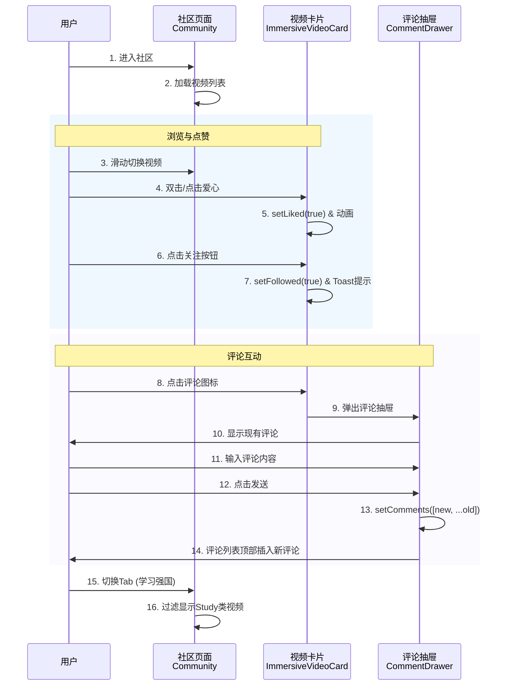
```mermaid
sequenceDiagram
    participant U as 用户
    participant C as 社区页面<br/>Community
    participant V as 视频卡片<br/>ImmersiveVideoCard
    participant M as 评论抽屉<br/>CommentDrawer
    
    U->>C: 1. 进入社区
    C->>C: 2. 加载视频列表
    
    rect rgb(240, 248, 255)
        Note over U,V: 浏览与点赞
        U->>C: 3. 滑动切换视频
        U->>V: 4. 双击/点击爱心
        V->>V: 5. setLiked(true) & 动画
        U->>V: 6. 点击关注按钮
        V->>V: 7. setFollowed(true) & Toast提示
    end
    
    rect rgb(250, 250, 255)
        Note over U,M: 评论互动
        U->>V: 8. 点击评论图标
        V->>M: 9. 弹出评论抽屉
        M->>U: 10. 显示现有评论
        
        U->>M: 11. 输入评论内容
        U->>M: 12. 点击发送
        M->>M: 13. setComments([new, ...old])
        M->>U: 14. 评论列表顶部插入新评论
    end
    
    U->>C: 15. 切换Tab (学习强国)
    C->>C: 16. 过滤显示Study类视频
```

---

## 其他核心功能链路

### 19. 实名认证流程

**完整调用链路：**

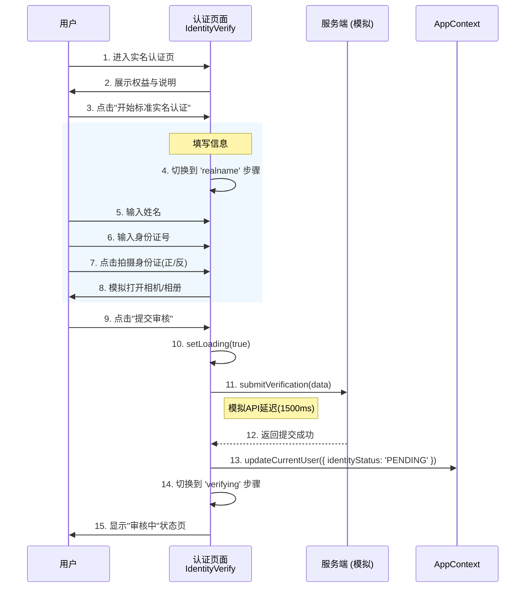
```mermaid
sequenceDiagram
    participant U as 用户
    participant P as 认证页面<br/>IdentityVerify
    participant S as 服务端 (模拟)
    participant C as AppContext

    U->>P: 1. 进入实名认证页
    P->>U: 2. 展示权益与说明
    U->>P: 3. 点击"开始标准实名认证"
    
    rect rgb(240, 248, 255)
        Note over P: 填写信息
        P->>P: 4. 切换到 'realname' 步骤
        U->>P: 5. 输入姓名
        U->>P: 6. 输入身份证号
        U->>P: 7. 点击拍摄身份证(正/反)
        P->>U: 8. 模拟打开相机/相册
    end

    U->>P: 9. 点击"提交审核"
    P->>P: 10. setLoading(true)
    P->>S: 11. submitVerification(data)
    Note right of P: 模拟API延迟(1500ms)
    
    S-->>P: 12. 返回提交成功
    P->>C: 13. updateCurrentUser({ identityStatus: 'PENDING' })
    P->>P: 14. 切换到 'verifying' 步骤
    P->>U: 15. 显示"审核中"状态页
```

---

### 20. 电工收入与提现流程

**完整调用链路：**

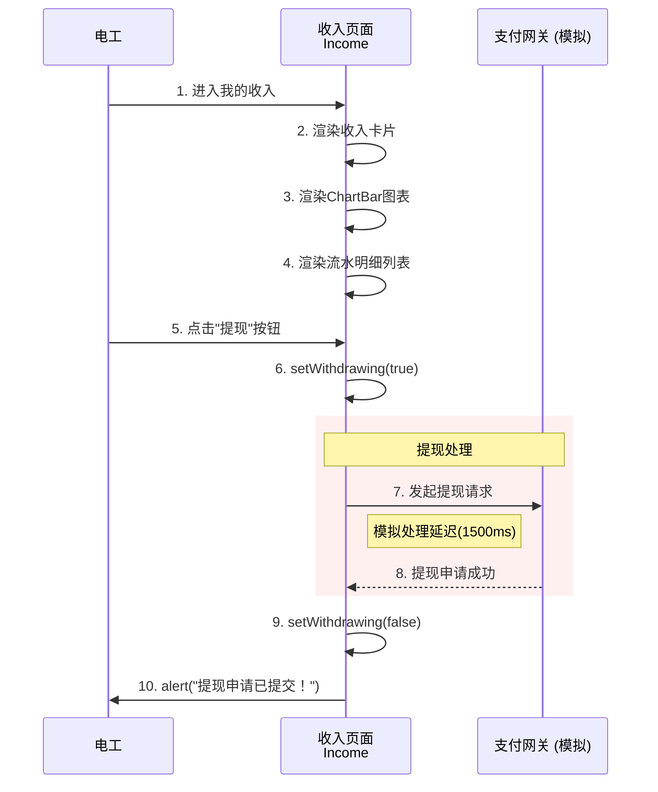
```mermaid
sequenceDiagram
    participant E as 电工
    participant I as 收入页面<br/>Income
    participant S as 支付网关 (模拟)

    E->>I: 1. 进入我的收入
    I->>I: 2. 渲染收入卡片
    I->>I: 3. 渲染ChartBar图表
    I->>I: 4. 渲染流水明细列表
    
    E->>I: 5. 点击"提现"按钮
    I->>I: 6. setWithdrawing(true)
    
    rect rgb(255, 240, 240)
        Note over I,S: 提现处理
        I->>S: 7. 发起提现请求
        Note right of I: 模拟处理延迟(1500ms)
        S-->>I: 8. 提现申请成功
    end
    
    I->>I: 9. setWithdrawing(false)
    I->>E: 10. alert("提现申请已提交！")
```

---

### 21. 用户地址管理流程

**完整调用链路：**

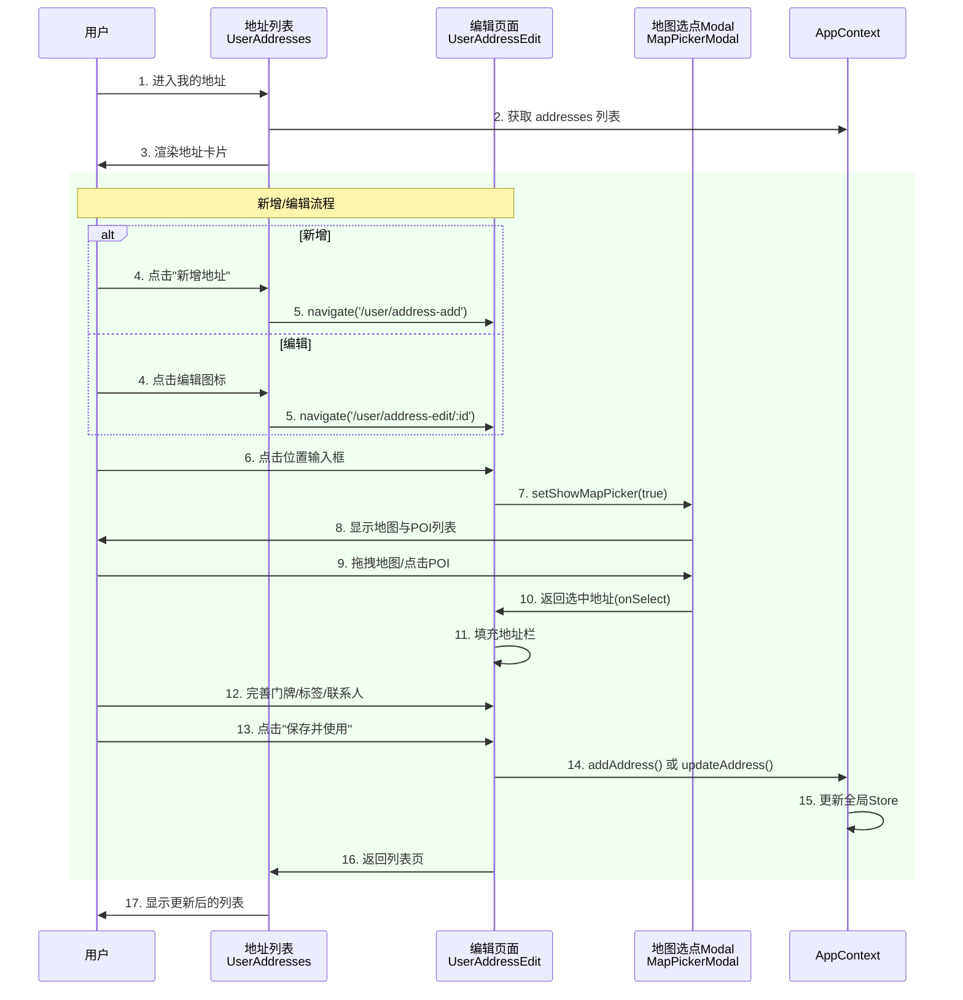
```mermaid
sequenceDiagram
    participant U as 用户
    participant L as 地址列表<br/>UserAddresses
    participant E as 编辑页面<br/>UserAddressEdit
    participant M as 地图选点Modal<br/>MapPickerModal
    participant C as AppContext

    U->>L: 1. 进入我的地址
    L->>C: 2. 获取 addresses 列表
    L->>U: 3. 渲染地址卡片

    rect rgb(240, 255, 240)
        Note over U,E: 新增/编辑流程
        alt 新增
            U->>L: 4. 点击"新增地址"
            L->>E: 5. navigate('/user/address-add')
        else 编辑
            U->>L: 4. 点击编辑图标
            L->>E: 5. navigate('/user/address-edit/:id')
        end
        
        U->>E: 6. 点击位置输入框
        E->>M: 7. setShowMapPicker(true)
        M->>U: 8. 显示地图与POI列表
        U->>M: 9. 拖拽地图/点击POI
        M->>E: 10. 返回选中地址(onSelect)
        E->>E: 11. 填充地址栏
        
        U->>E: 12. 完善门牌/标签/联系人
        U->>E: 13. 点击"保存并使用"
        E->>C: 14. addAddress() 或 updateAddress()
        C->>C: 15. 更新全局Store
        E->>L: 16. 返回列表页
    end

    L->>U: 17. 显示更新后的列表
```

---

### 22. 电工技能与证书管理

**完整调用链路：**

```mermaid
sequenceDiagram
    participant E as 电工
    participant S as 技能页面<br/>ElecSkills
    
    E->>S: 1. 进入技能与证书页面
    S->>S: 2. 初始化技能列表状态
    S->>E: 3. 显示已认证证书 & 技能网格
    
    loop 技能选择
        E->>S: 4. 点击"智能家居"
        S->>S: 5. toggleSkill(id)
        S->>S: 6. 更新 selected 状态
        S->>E: 7. 按钮样式变更(高亮)
    end
    
    rect rgb(245, 245, 245)
        Note over E,S: 证书上传
        E->>S: 8. 点击"上传新证书"
        S->>E: 9. 打开文件选择器(模拟)
    end
    
    E->>S: 10. 点击"保存修改"
    S->>S: 11. 提交数据(Mock)
    S-->>E: 12. 返回上一页
```

---

### 23. 服务区域设置流程

**完整调用链路：**

```mermaid
sequenceDiagram
    participant E as 电工
    participant A as 区域页面<br/>ElecServiceArea
    
    E->>A: 1. 进入服务区域设置
    A->>E: 2. 显示地图预览 & 半径滑块
    
    rect rgb(240, 248, 255)
        Note over E,A: 调整半径
        E->>A: 3. 拖动滑块 (1km -> 10km)
        A->>A: 4. events.onChange(value)
        A->>A: 5. setRadius(10)
        A->>E: 6. 更新数字显示
    end
    
    rect rgb(255, 250, 240)
        Note over E,A: 偏好区域
        E->>A: 7. 点击"浦东新区"
        A->>E: 8. 按钮高亮反馈
    end
    
    E->>A: 9. 点击"保存设置"
    A-->>E: 10. 返回上一页
```

---

## 通用链路说明

### 请求流程标准步骤

**前端 → 后端：**

1. **用户操作** → 触发事件
2. **页面组件** → 调用API方法
3. **API封装** → 调用request
4. **Request工具** → 添加Token、Headers
5. **发送请求** → Gateway
6. **Gateway** → 路由匹配、认证
7. **微服务** → Controller接收
8. **Controller** → 参数校验、调用Service
9. **Service** → 业务逻辑、调用Mapper
10. **Mapper** → 执行SQL
11. **MySQL** → 返回数据

**后端 → 前端：**

12. **Mapper** → 返回Entity
13. **Service** → 返回业务对象
14. **Controller** → 转换为VO、包装Result
15. **微服务** → 返回JSON
16. **Gateway** → 转发响应
17. **Request** → 响应拦截、错误处理
18. **API封装** → 返回业务数据
19. **页面组件** → 更新状态、渲染UI
20. **用户** → 看到结果

### 认证流程

**Token传递链路：**

```mermaid
graph LR
    A[用户登录] --> B[后端生成Token]
    B --> C[前端保存Storage]
    C --> D[每次请求携带]
    D --> E[Gateway验证]
    E --> F[提取userId]
    F --> G[传递给微服务]
```

---

## 错误处理链路

### 统一错误处理流程

```mermaid
sequenceDiagram
    participant P as 页面
    participant R as Request
    participant G as Gateway
    participant S as Service
    participant EH as ExceptionHandler
    
    P->>R: 1. 发起请求
    R->>G: 2. 转发
    G->>S: 3. 调用服务
    
    alt 业务异常
        S->>S: 4. throw BusinessException
        S->>EH: 5. 捕获异常
        EH->>EH: 6. 构造错误响应
        EH-->>G: 7. {"code": 1002, "message": "..."}
        G-->>R: 8. 返回错误
        R->>R: 9. 检查code != 0
        R->>R: 10. showToast(message)
        R-->>P: 11. throw error
        P->>P: 12. catch处理
    else Token过期
        G->>G: 13. 验证Token失败
        G-->>R: 14. 401 Unauthorized
        R->>R: 15. 清除Token
        R->>R: 16. 跳转登录页
    else 网络错误
        R->>R: 17. catch网络异常
        R->>R: 18. showToast('网络错误')
    end
```

---

## 附录：完整示例调用

### curl测试命令

```bash
# 1. 注册
curl -X POST http://localhost:8080/api/user/register \
  -H "Content-Type: application/json" \
  -d '{"phone":"13800138000","code":"1234","role":"USER"}'

# 2. 登录（获取Token）
curl -X POST http://localhost:8080/api/user/login \
  -H "Content-Type: application/json" \
  -d '{"phone":"13800138000","code":"1234"}'
# 响应: {"code":0,"data":{"token":"eyJhbG..."}}

# 3. 查询任务列表（需要Token）
curl -X GET "http://localhost:8080/api/task/list?pageNum=1&pageSize=10" \
  -H "Authorization: Bearer YOUR_TOKEN"

# 4. 发布任务
curl -X POST http://localhost:8080/api/task/publish \
  -H "Authorization: Bearer YOUR_TOKEN" \
  -H "Content-Type: application/json" \
  -d '{
    "title": "电路维修",
    "description": "需要维修",
    "reward": 100,
    "address": "北京xxx"
  }'

# 5. 接单
curl -X POST http://localhost:8080/api/task/1/accept \
  -H "Authorization: Bearer YOUR_TOKEN"
```

---

## 关键文件速查表

| 功能 | 前端文件 | 后端文件 |
|-----|---------|---------|
| **注册** | `pages/user/login/index.tsx`<br/>`services/api/user.ts` | `UserController.register()`<br/>`UserServiceImpl.register()` |
| **登录** | 同上 | `UserController.login()`<br/>`UserServiceImpl.login()` |
| **任务列表** | `pages/home/index.tsx`<br/>`services/api/task.ts` | `TaskController.list()`<br/>`TaskServiceImpl.page()` |
| **发布任务** | `pages/task/publish.tsx` | `TaskController.publish()`<br/>`TaskServiceImpl.publish()` |
| **接单** | `pages/task/detail.tsx` | `TaskController.accept()`<br/>`TaskServiceImpl.accept()` |
| **创建订单** | `pages/order/create.tsx` | `OrderController.create()`<br/>`OrderServiceImpl.create()` |

---

**文档维护**: 架构团队  
**联系方式**: arch@andiantong.com
