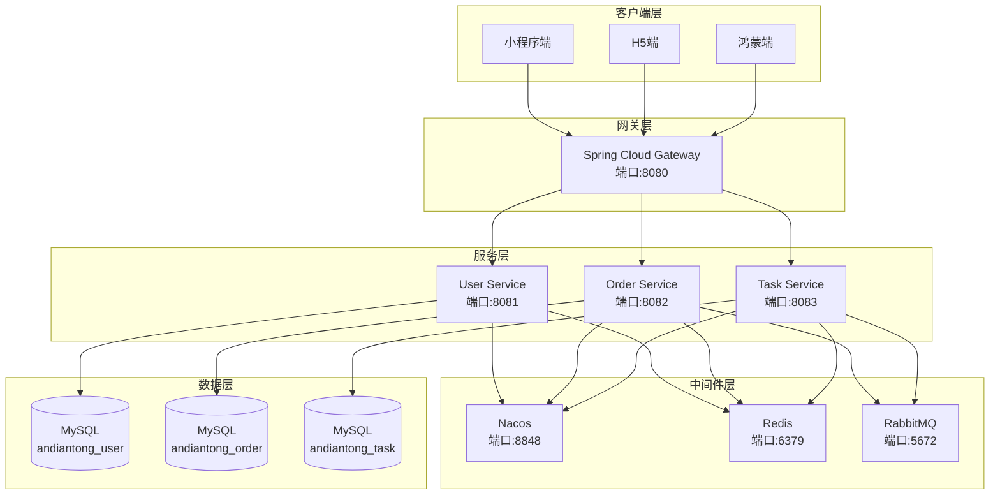

# 安电通企业端后端开发文档

> **版本**: v1.0.0  
> **更新日期**: 2026-01-27  
> **适用人群**: 后端开发工程师

---

## 📋 目录

1. [项目概述](#项目概述)
2. [技术架构](#技术架构)
3. [环境搭建](#环境搭建)
4. [项目结构](#项目结构)
5. [开发规范](#开发规范)
6. [核心模块](#核心模块)
7. [API设计](#api设计)
8. [数据库设计](#数据库设计)
9. [部署指南](#部署指南)
10. [常见问题](#常见问题)

---

## 项目概述

### 业务背景

**安电通企业端**是一个为电工和企业提供任务管理、服务调度的SaaS平台。

**核心功能：**
- 👤 用户管理（注册、登录、权限）
- 📋 任务管理（发布、接单、完成）
- 💰 订单管理（创建、支付、结算）
- 📊 数据统计（任务统计、收益统计）

### 技术选型

| 技术栈 | 版本 | 说明 |
|-------|------|------|
| **JDK** | 17 | LTS版本，性能优化 |
| **Spring Boot** | 3.2.0 | 核心框架 |
| **Spring Cloud** | 2023.0.0 | 微服务治理 |
| **Spring Cloud Alibaba** | 2023.0.0.0-RC1 | 阿里巴巴微服务组件 |
| **Nacos** | 2.3.0 | 注册中心/配置中心 |
| **Spring Cloud Gateway** | - | API网关 |
| **MyBatis Plus** | 3.5.5 | ORM框架 |
| **MySQL** | 8.0+ | 关系型数据库 |
| **Maven** | 3.8+ | 项目构建工具 |

---

## 技术架构

### 整体架构图



### 服务划分

| 服务名 | 端口 | 数据库 | 职责 |
|-------|------|--------|------|
| **gateway-service** | 8080 | - | API网关、路由转发、统一鉴权 |
| **user-service** | 8081 | andiantong_user | 用户管理、认证授权 |
| **order-service** | 8082 | andiantong_order | 订单管理、支付结算 |
| **task-service** | 8083 | andiantong_task | 任务管理、派单调度 |

---

## 环境搭建

### 开发环境要求

**必需：**
- ✅ JDK 17+
- ✅ Maven 3.8+
- ✅ MySQL 8.0+
- ✅ Nacos 2.3.0+
- ✅ IDE: IntelliJ IDEA 2023+（推荐）

**可选：**
- Redis 6.0+（缓存）
- RabbitMQ 3.12+（消息队列）

### 安装步骤

#### 1. 安装JDK 17

```bash
# Windows：下载Oracle JDK 17安装包
# 配置环境变量 JAVA_HOME

# 验证安装
java -version
```

#### 2. 安装MySQL

```bash
# 下载MySQL 8.0安装包
# 创建数据库
mysql -u root -p

CREATE DATABASE andiantong_user CHARACTER SET utf8mb4 COLLATE utf8mb4_unicode_ci;
CREATE DATABASE andiantong_order CHARACTER SET utf8mb4 COLLATE utf8mb4_unicode_ci;
CREATE DATABASE andiantong_task CHARACTER SET utf8mb4 COLLATE utf8mb4_unicode_ci;
```

#### 3. 安装Nacos

```bash
# 下载Nacos 2.3.0
# https://github.com/alibaba/nacos/releases

# 解压后启动（单机模式）
cd nacos/bin

# Windows
startup.cmd -m standalone

# Linux/Mac
sh startup.sh -m standalone

# 访问控制台
# http://localhost:8848/nacos
# 默认账号密码：nacos/nacos
```

#### 4. 导入项目

```bash
# 克隆项目
cd c:\Users\21389\Downloads\12259\andiantong-enterprise\backend

# Maven依赖下载
mvn clean install
```

#### 5. 初始化数据库

```sql
-- 执行SQL脚本（位置：backend/sql/）
source backend/sql/init_user_service.sql;
source backend/sql/init_order_service.sql;
source backend/sql/init_task_service.sql;
```

### 启动服务

```bash
# 1. 确保Nacos已启动

# 2. 启动Gateway
cd gateway
mvn spring-boot:run

# 3. 启动User Service
cd user-service
mvn spring-boot:run

# 4. 启动其他服务...
```

**验证启动成功：**
- Gateway: http://localhost:8080
- Nacos控制台: http://localhost:8848/nacos（查看服务列表）

---

## 项目结构

### Maven多模块结构

```
andiantong-enterprise/backend/
├── pom.xml                          # 父POM，统一依赖管理
├── gateway/                         # API网关
│   ├── src/
│   │   └── main/
│   │       ├── java/
│   │       │   └── com/andiantong/gateway/
│   │       │       ├── GatewayApplication.java
│   │       │       ├── filter/      # 过滤器
│   │       │       └── config/      # 配置类
│   │       └── resources/
│   │           └── application.yml
│   └── pom.xml
│
├── user-service/                    # 用户服务
│   ├── src/
│   │   └── main/
│   │       ├── java/
│   │       │   └── com/andiantong/user/
│   │       │       ├── UserServiceApplication.java
│   │       │       ├── controller/  # 控制器
│   │       │       ├── service/     # 业务层
│   │       │       ├── mapper/      # 数据访问层
│   │       │       ├── entity/      # 实体类
│   │       │       ├── dto/         # 数据传输对象
│   │       │       ├── vo/          # 视图对象
│   │       │       └── config/      # 配置类
│   │       └── resources/
│   │           ├── application.yml
│   │           └── mapper/          # MyBatis XML
│   └── pom.xml
│
├── order-service/                   # 订单服务（待开发）
└── task-service/                    # 任务服务（待开发）
```

### 标准服务目录结构

```
user-service/src/main/java/com/andiantong/user/
├── UserServiceApplication.java      # 启动类
├── controller/                      # 控制器层
│   ├── UserController.java         # 用户控制器
│   └── AuthController.java         # 认证控制器
├── service/                        # 业务逻辑层
│   ├── UserService.java           # 接口
│   └── impl/
│       └── UserServiceImpl.java   # 实现类
├── mapper/                         # 数据访问层
│   └── UserMapper.java
├── entity/                         # 实体类（对应数据库表）
│   └── User.java
├── dto/                           # 数据传输对象（请求参数）
│   ├── LoginDTO.java
│   └── RegisterDTO.java
├── vo/                            # 视图对象（返回结果）
│   └── UserVO.java
├── config/                        # 配置类
│   ├── MyBatisPlusConfig.java
│   └── WebMvcConfig.java
├── common/                        # 通用类
│   ├── Result.java               # 统一返回结果
│   ├── ResultCode.java           # 返回码
│   └── exception/                # 自定义异常
│       └── BusinessException.java
└── util/                         # 工具类
    ├── JwtUtil.java
    └── ValidationUtil.java
```

---

## 开发规范

### 代码规范

#### 1. 命名规范

**类命名：**
- Controller: `XxxController`
- Service接口: `XxxService`
- Service实现: `XxxServiceImpl`
- Mapper: `XxxMapper`
- Entity: `Xxx`（与数据库表对应）
- DTO: `XxxDTO`
- VO: `XxxVO`

**方法命名：**
```java
// 查询
User getById(Long id)
List<User> listByCondition(UserQueryDTO query)
Page<User> pageByCondition(UserQueryDTO query, int pageNum, int pageSize)

// 新增
boolean save(User user)
boolean saveBatch(List<User> users)

// 更新
boolean updateById(User user)
boolean updateBatchById(List<User> users)

// 删除
boolean removeById(Long id)
boolean removeBatchByIds(List<Long> ids)
```

#### 2. 注释规范

```java
/**
 * 用户服务实现类
 *
 * @author 后端开发组
 * @since 2026-01-27
 */
@Service
public class UserServiceImpl extends ServiceImpl<UserMapper, User> implements UserService {

    /**
     * 用户登录
     *
     * @param phone 手机号
     * @param code  验证码
     * @return 用户信息
     * @throws BusinessException 验证码错误或用户不存在
     */
    @Override
    public User login(String phone, String code) {
        // 实现代码...
    }
}
```

#### 3. 异常处理

```java
// ❌ 不推荐
throw new RuntimeException("User not found");

// ✅ 推荐
throw new BusinessException(ResultCode.USER_NOT_FOUND);

// 全局异常处理器
@RestControllerAdvice
public class GlobalExceptionHandler {
    
    @ExceptionHandler(BusinessException.class)
    public Result handleBusinessException(BusinessException e) {
        return Result.error(e.getCode(), e.getMessage());
    }
}
```

### API设计规范

#### 1. RESTful API

```
# 资源命名使用复数
GET    /api/users          # 获取用户列表
GET    /api/users/{id}     # 获取单个用户
POST   /api/users          # 创建用户
PUT    /api/users/{id}     # 更新用户
DELETE /api/users/{id}     # 删除用户

# 子资源
GET    /api/users/{id}/orders  # 获取用户的订单列表
```

#### 2. 统一返回格式

```json
{
  "code": 0,
  "message": "success",
  "data": {
    "id": 1,
    "username": "zhangsan"
  }
}
```

**Result类定义：**
```java
@Data
public class Result<T> {
    private Integer code;
    private String message;
    private T data;
    
    public static <T> Result<T> success(T data) {
        Result<T> result = new Result<>();
        result.setCode(0);
        result.setMessage("success");
        result.setData(data);
        return result;
    }
    
    public static <T> Result<T> error(Integer code, String message) {
        Result<T> result = new Result<>();
        result.setCode(code);
        result.setMessage(message);
        return result;
    }
}
```

#### 3. 分页响应

```json
{
  "code": 0,
  "message": "success",
  "data": {
    "records": [...],
    "total": 100,
    "pageNum": 1,
    "pageSize": 10
  }
}
```

### 数据库规范

#### 1. 表命名

- 小写字母，下划线分隔
- 前缀：`t_`
- 示例：`t_user`, `t_order`, `t_task`

#### 2. 字段命名

- 小写字母，下划线分隔
- 主键：`id` (BIGINT)
- 创建时间：`create_time` (DATETIME)
- 更新时间：`update_time` (DATETIME)
- 逻辑删除：`deleted` (TINYINT)

#### 3. 必需字段

```sql
CREATE TABLE t_user (
    id BIGINT PRIMARY KEY AUTO_INCREMENT,
    -- 业务字段...
    
    -- 必需的通用字段
    create_time DATETIME NOT NULL DEFAULT CURRENT_TIMESTAMP COMMENT '创建时间',
    update_time DATETIME NOT NULL DEFAULT CURRENT_TIMESTAMP ON UPDATE CURRENT_TIMESTAMP COMMENT '更新时间',
    deleted TINYINT NOT NULL DEFAULT 0 COMMENT '逻辑删除 0-未删除 1-已删除'
) ENGINE=InnoDB DEFAULT CHARSET=utf8mb4 COMMENT='用户表';
```

---

## 核心模块

### 用户服务（user-service）

#### 功能模块

1. **用户注册**
   - 手机号验证
   - 短信验证码
   - 角色选择（用户/企业）

2. **用户登录**
   - 手机号 + 验证码登录
   - JWT Token生成
   - Token刷新

3. **用户管理**
   - 个人信息查询
   - 个人信息修改
   - 密码修改

#### 核心接口

```java
@RestController
@RequestMapping("/user")
public class UserController {
    
    @Autowired
    private UserService userService;
    
    /**
     * 用户注册
     */
    @PostMapping("/register")
    public Result<UserVO> register(@RequestBody @Valid RegisterDTO dto) {
        User user = userService.register(dto.getPhone(), dto.getRole());
        return Result.success(convertToVO(user));
    }
    
    /**
     * 用户登录
     */
    @PostMapping("/login")
    public Result<LoginVO> login(@RequestBody @Valid LoginDTO dto) {
        User user = userService.login(dto.getPhone(), dto.getCode());
        String token = JwtUtil.generateToken(user);
        
        LoginVO vo = new LoginVO();
        vo.setToken(token);
        vo.setUser(convertToVO(user));
        return Result.success(vo);
    }
    
    /**
     * 获取当前用户信息
     */
    @GetMapping("/info")
    public Result<UserVO> getUserInfo(@RequestHeader("Authorization") String token) {
        Long userId = JwtUtil.getUserId(token);
        User user = userService.getById(userId);
        return Result.success(convertToVO(user));
    }
}
```

### 网关服务（gateway-service）

#### 功能模块

1. **路由转发**
   - 根据路径前缀转发到对应服务
   - 负载均衡

2. **全局过滤器**
   - Token验证
   - 日志记录
   - 跨域处理

#### 路由配置

```yaml
spring:
  cloud:
    gateway:
      routes:
        # 用户服务路由
        - id: user_route
          uri: lb://user-service
          predicates:
            - Path=/api/user/**
          filters:
            - StripPrefix=1
            
        # 订单服务路由
        - id: order_route
          uri: lb://order-service
          predicates:
            - Path=/api/order/**
          filters:
            - StripPrefix=1
```

#### 全局过滤器

```java
@Component
public class AuthFilter implements GlobalFilter, Ordered {
    
    @Override
    public Mono<Void> filter(ServerWebExchange exchange, GatewayFilterChain chain) {
        String path = exchange.getRequest().getPath().value();
        
        // 白名单路径，不需要验证Token
        if (isWhitelist(path)) {
            return chain.filter(exchange);
        }
        
        // 验证Token
        String token = exchange.getRequest().getHeaders().getFirst("Authorization");
        if (StringUtils.isEmpty(token) || !JwtUtil.validateToken(token)) {
            exchange.getResponse().setStatusCode(HttpStatus.UNAUTHORIZED);
            return exchange.getResponse().setComplete();
        }
        
        return chain.filter(exchange);
    }
    
    @Override
    public int getOrder() {
        return -100;
    }
}
```

---

## API设计

### API文档规范

使用**Swagger/OpenAPI**自动生成API文档。

#### 配置Swagger

```java
@Configuration
@EnableOpenApi
public class SwaggerConfig {
    
    @Bean
    public OpenAPI openAPI() {
        return new OpenAPI()
            .info(new Info()
                .title("安电通企业端API")
                .version("v1.0.0")
                .description("安电通企业端后端接口文档"));
    }
}
```

#### 接口注解

```java
@RestController
@RequestMapping("/user")
@Tag(name = "用户管理", description = "用户相关接口")
public class UserController {
    
    @Operation(summary = "用户注册", description = "通过手机号注册新用户")
    @PostMapping("/register")
    public Result<UserVO> register(
        @Parameter(description = "注册信息") @RequestBody @Valid RegisterDTO dto
    ) {
        // ...
    }
}
```

### API接口清单

#### 用户服务 (user-service)

| 接口路径 | 方法 | 说明 | 需要认证 |
|---------|------|------|---------|
| /user/register | POST | 用户注册 | ❌ |
| /user/login | POST | 用户登录 | ❌ |
| /user/info | GET | 获取用户信息 | ✅ |
| /user/update | PUT | 更新用户信息 | ✅ |
| /user/changePhone | POST | 修改手机号 | ✅ |

---

## 数据库设计

### 用户表 (t_user)

```sql
CREATE TABLE t_user (
    id BIGINT PRIMARY KEY AUTO_INCREMENT COMMENT '用户ID',
    phone VARCHAR(11) NOT NULL UNIQUE COMMENT '手机号',
    nick_name VARCHAR(50) COMMENT '昵称',
    avatar VARCHAR(255) COMMENT '头像URL',
    role VARCHAR(20) NOT NULL COMMENT '角色 USER-普通用户 ENTERPRISE-企业用户',
    status TINYINT NOT NULL DEFAULT 1 COMMENT '状态 0-禁用 1-正常',
    create_time DATETIME NOT NULL DEFAULT CURRENT_TIMESTAMP COMMENT '创建时间',
    update_time DATETIME NOT NULL DEFAULT CURRENT_TIMESTAMP ON UPDATE CURRENT_TIMESTAMP COMMENT '更新时间',
    deleted TINYINT NOT NULL DEFAULT 0 COMMENT '逻辑删除',
    INDEX idx_phone (phone),
    INDEX idx_role (role)
) ENGINE=InnoDB DEFAULT CHARSET=utf8mb4 COMMENT='用户表';
```

### 订单表 (t_order)

```sql
CREATE TABLE t_order (
    id BIGINT PRIMARY KEY AUTO_INCREMENT COMMENT '订单ID',
    order_no VARCHAR(32) NOT NULL UNIQUE COMMENT '订单号',
    user_id BIGINT NOT NULL COMMENT '用户ID',
    task_id BIGINT COMMENT '关联任务ID',
    amount DECIMAL(10,2) NOT NULL COMMENT '订单金额',
    status VARCHAR(20) NOT NULL COMMENT '订单状态',
    pay_time DATETIME COMMENT '支付时间',
    create_time DATETIME NOT NULL DEFAULT CURRENT_TIMESTAMP,
    update_time DATETIME NOT NULL DEFAULT CURRENT_TIMESTAMP ON UPDATE CURRENT_TIMESTAMP,
    deleted TINYINT NOT NULL DEFAULT 0,
    INDEX idx_user_id (user_id),
    INDEX idx_order_no (order_no)
) ENGINE=InnoDB DEFAULT CHARSET=utf8mb4 COMMENT='订单表';
```

---

## 部署指南

### 本地开发部署

```bash
# 1. 启动Nacos
cd nacos/bin
startup.cmd -m standalone

# 2. 启动MySQL
# 确保MySQL服务运行在3306端口

# 3. 启动服务
# IDEA中依次启动：Gateway -> User Service -> ...
```

### 生产环境部署

#### 1. 打包

```bash
# 在项目根目录执行
cd andiantong-enterprise/backend
mvn clean package -Dmaven.test.skip=true

# 产物位置
target/user-service-1.0.0-SNAPSHOT.jar
target/gateway-1.0.0-SNAPSHOT.jar
```

#### 2. Docker部署

**Dockerfile示例：**
```dockerfile
FROM openjdk:17-jdk-slim
WORKDIR /app
COPY target/*.jar app.jar
EXPOSE 8081
ENTRYPOINT ["java", "-jar", "app.jar"]
```

**docker-compose.yml：**
```yaml
version: '3.8'
services:
  nacos:
    image: nacos/nacos-server:v2.3.0
    ports:
      - "8848:8848"
    environment:
      - MODE=standalone
      
  mysql:
    image: mysql:8.0
    ports:
      - "3306:3306"
    environment:
      - MYSQL_ROOT_PASSWORD=password
      
  gateway:
    build: ./gateway
    ports:
      - "8080:8080"
    depends_on:
      - nacos
      
  user-service:
    build: ./user-service
    ports:
      - "8081:8081"
    depends_on:
      - nacos
      - mysql
```

#### 3. 启动

```bash
docker-compose up -d
```

---

## 常见问题

### Q1: Nacos注册失败？

**问题：**服务启动后无法在Nacos控制台看到

**解决：**
1. 检查Nacos是否启动：访问 http://localhost:8848/nacos
2. 检查配置文件中的Nacos地址
3. 检查网络连接

### Q2: 数据库连接失败？

**问题：**启动报错 `Communications link failure`

**解决：**
1. 检查MySQL是否启动
2. 检查`application.yml`中的数据库配置
3. 确认数据库和表已创建

### Q3: 端口冲突？

**问题：**启动报错 `Port 8080 already in use`

**解决：**
```bash
# Windows查看端口占用
netstat -ano | findstr 8080

# 杀死进程
taskkill /PID <进程ID> /F
```

---

## 附录

### 返回码定义

| Code | Message | 说明 |
|------|---------|------|
| 0 | success | 成功 |
| 1001 | 参数错误 | 请求参数不合法 |
| 1002 | 用户不存在 | 用户未注册 |
| 1003 | 验证码错误 | 短信验证码错误 |
| 1004 | 未登录 | Token无效或过期 |
| 1005 | 无权限 | 没有访问权限 |
| 5000 | 系统错误 | 服务器内部错误 |

### 参考资料

- [Spring Boot官方文档](https://spring.io/projects/spring-boot)
- [Spring Cloud官方文档](https://spring.io/projects/spring-cloud)
- [MyBatis Plus官方文档](https://baomidou.com/)
- [Nacos官方文档](https://nacos.io/zh-cn/docs/what-is-nacos.html)

---

**文档维护**: 后端开发组  
**联系方式**: backend-dev@andiantong.com
