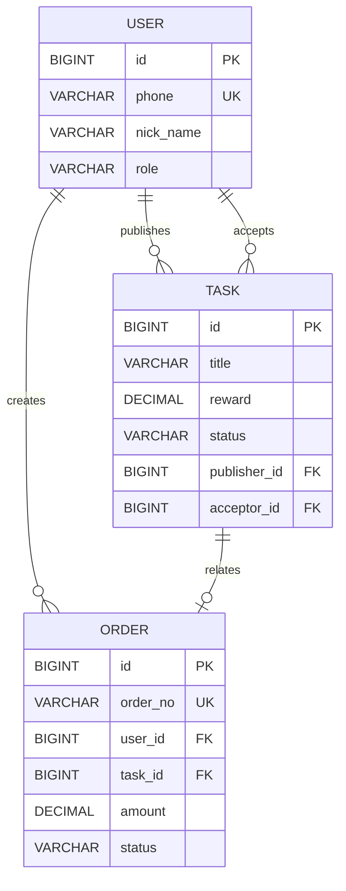

# 安电通企业端数据字典

> **完整的数据库字段定义文档**  
> **版本**: v1.0.0  
> **更新日期**: 2026-01-27

---

## 📋 目录

1. [用户服务数据库](#用户服务数据库)
2. [任务服务数据库](#任务服务数据库)
3. [订单服务数据库](#订单服务数据库)
4. [通用字段说明](#通用字段说明)
5. [枚举值定义](#枚举值定义)

---

## 用户服务数据库

### 数据库：andiantong_user

#### 表：t_user（用户表）

| 字段名 | 类型 | 长度 | 默认值 | 允许空 | 主键 | 说明 |
|-------|------|------|--------|--------|------|------|
| id | BIGINT | - | AUTO_INCREMENT | 否 | ✅ | 用户ID |
| phone | VARCHAR | 11 | - | 否 | - | 手机号（唯一） |
| nick_name | VARCHAR | 50 | NULL | 是 | - | 昵称 |
| avatar | VARCHAR | 255 | NULL | 是 | - | 头像URL |
| role | VARCHAR | 20 | - | 否 | - | 角色：USER/ENTERPRISE |
| status | TINYINT | - | 1 | 否 | - | 状态：0-禁用 1-正常 |
| create_time | DATETIME | - | CURRENT_TIMESTAMP | 否 | - | 创建时间 |
| update_time | DATETIME | - | CURRENT_TIMESTAMP | 否 | - | 更新时间 |
| deleted | TINYINT | - | 0 | 否 | - | 逻辑删除：0-未删除 1-已删除 |

**索引：**
- PRIMARY KEY: `id`
- UNIQUE KEY: `uk_phone` (`phone`)
- INDEX: `idx_role` (`role`)
- INDEX: `idx_status` (`status`)

**建表SQL：**
```sql
CREATE TABLE t_user (
    id BIGINT PRIMARY KEY AUTO_INCREMENT COMMENT '用户ID',
    phone VARCHAR(11) NOT NULL UNIQUE COMMENT '手机号',
    nick_name VARCHAR(50) COMMENT '昵称',
    avatar VARCHAR(255) COMMENT '头像URL',
    role VARCHAR(20) NOT NULL COMMENT '角色 USER-普通用户 ENTERPRISE-企业用户',
    status TINYINT NOT NULL DEFAULT 1 COMMENT '状态 0-禁用 1-正常',
    create_time DATETIME NOT NULL DEFAULT CURRENT_TIMESTAMP COMMENT '创建时间',
    update_time DATETIME NOT NULL DEFAULT CURRENT_TIMESTAMP ON UPDATE CURRENT_TIMESTAMP COMMENT '更新时间',
    deleted TINYINT NOT NULL DEFAULT 0 COMMENT '逻辑删除 0-未删除 1-已删除',
    INDEX idx_role (role),
    INDEX idx_status (status)
) ENGINE=InnoDB DEFAULT CHARSET=utf8mb4 COMMENT='用户表';
```

**示例数据：**
```json
{
  "id": 1,
  "phone": "13800138000",
  "nick_name": "张师傅",
  "avatar": "https://example.com/avatar/1.jpg",
  "role": "USER",
  "status": 1,
  "create_time": "2026-01-27 10:00:00",
  "update_time": "2026-01-27 10:00:00",
  "deleted": 0
}
```

---

## 任务服务数据库

### 数据库：andiantong_task

#### 表：t_task（任务表）

| 字段名 | 类型 | 长度 | 默认值 | 允许空 | 主键 | 说明 |
|-------|------|------|--------|--------|------|------|
| id | BIGINT | - | AUTO_INCREMENT | 否 | ✅ | 任务ID |
| title | VARCHAR | 100 | - | 否 | - | 任务标题 |
| description | TEXT | - | NULL | 是 | - | 任务描述 |
| reward | DECIMAL | 10,2 | - | 否 | - | 任务报酬（元） |
| address | VARCHAR | 255 | NULL | 是 | - | 任务地址 |
| images | JSON | - | NULL | 是 | - | 任务图片数组 |
| status | VARCHAR | 20 | PENDING | 否 | - | 任务状态 |
| publisher_id | BIGINT | - | - | 否 | - | 发布者ID |
| acceptor_id | BIGINT | - | NULL | 是 | - | 接单者ID |
| accept_time | DATETIME | - | NULL | 是 | - | 接单时间 |
| complete_time | DATETIME | - | NULL | 是 | - | 完成时间 |
| create_time | DATETIME | - | CURRENT_TIMESTAMP | 否 | - | 创建时间 |
| update_time | DATETIME | - | CURRENT_TIMESTAMP | 否 | - | 更新时间 |
| deleted | TINYINT | - | 0 | 否 | - | 逻辑删除 |

**索引：**
- PRIMARY KEY: `id`
- INDEX: `idx_publisher_id` (`publisher_id`)
- INDEX: `idx_acceptor_id` (`acceptor_id`)
- INDEX: `idx_status` (`status`)
- INDEX: `idx_create_time` (`create_time`)

**建表SQL：**
```sql
CREATE TABLE t_task (
    id BIGINT PRIMARY KEY AUTO_INCREMENT COMMENT '任务ID',
    title VARCHAR(100) NOT NULL COMMENT '任务标题',
    description TEXT COMMENT '任务描述',
    reward DECIMAL(10,2) NOT NULL COMMENT '任务报酬（元）',
    address VARCHAR(255) COMMENT '任务地址',
    images JSON COMMENT '任务图片数组',
    status VARCHAR(20) NOT NULL DEFAULT 'PENDING' COMMENT '任务状态',
    publisher_id BIGINT NOT NULL COMMENT '发布者ID',
    acceptor_id BIGINT COMMENT '接单者ID',
    accept_time DATETIME COMMENT '接单时间',
    complete_time DATETIME COMMENT '完成时间',
    create_time DATETIME NOT NULL DEFAULT CURRENT_TIMESTAMP COMMENT '创建时间',
    update_time DATETIME NOT NULL DEFAULT CURRENT_TIMESTAMP ON UPDATE CURRENT_TIMESTAMP COMMENT '更新时间',
    deleted TINYINT NOT NULL DEFAULT 0 COMMENT '逻辑删除',
    INDEX idx_publisher_id (publisher_id),
    INDEX idx_acceptor_id (acceptor_id),
    INDEX idx_status (status),
    INDEX idx_create_time (create_time)
) ENGINE=InnoDB DEFAULT CHARSET=utf8mb4 COMMENT='任务表';
```

**示例数据：**
```json
{
  "id": 1,
  "title": "电路故障维修",
  "description": "家里客厅的电路出现故障，需要专业电工维修",
  "reward": 100.00,
  "address": "北京市朝阳区xxx小区1号楼",
  "images": ["https://example.com/task/1-1.jpg", "https://example.com/task/1-2.jpg"],
  "status": "PENDING",
  "publisher_id": 10,
  "acceptor_id": null,
  "accept_time": null,
  "complete_time": null,
  "create_time": "2026-01-27 10:00:00",
  "update_time": "2026-01-27 10:00:00",
  "deleted": 0
}
```

---

## 订单服务数据库

### 数据库：andiantong_order

#### 表：t_order（订单表）

| 字段名 | 类型 | 长度 | 默认值 | 允许空 | 主键 | 说明 |
|-------|------|------|--------|--------|------|------|
| id | BIGINT | - | AUTO_INCREMENT | 否 | ✅ | 订单ID |
| order_no | VARCHAR | 32 | - | 否 | - | 订单号（唯一） |
| user_id | BIGINT | - | - | 否 | - | 用户ID |
| task_id | BIGINT | - | NULL | 是 | - | 关联任务ID |
| amount | DECIMAL | 10,2 | - | 否 | - | 订单金额（元） |
| status | VARCHAR | 20 | PENDING | 否 | - | 订单状态 |
| pay_type | VARCHAR | 20 | NULL | 是 | - | 支付方式 |
| pay_time | DATETIME | - | NULL | 是 | - | 支付时间 |
| transaction_id | VARCHAR | 64 | NULL | 是 | - | 第三方交易ID |
| create_time | DATETIME | - | CURRENT_TIMESTAMP | 否 | - | 创建时间 |
| update_time | DATETIME | - | CURRENT_TIMESTAMP | 否 | - | 更新时间 |
| deleted | TINYINT | - | 0 | 否 | - | 逻辑删除 |

**索引：**
- PRIMARY KEY: `id`
- UNIQUE KEY: `uk_order_no` (`order_no`)
- INDEX: `idx_user_id` (`user_id`)
- INDEX: `idx_task_id` (`task_id`)
- INDEX: `idx_status` (`status`)

**建表SQL：**
```sql
CREATE TABLE t_order (
    id BIGINT PRIMARY KEY AUTO_INCREMENT COMMENT '订单ID',
    order_no VARCHAR(32) NOT NULL UNIQUE COMMENT '订单号',
    user_id BIGINT NOT NULL COMMENT '用户ID',
    task_id BIGINT COMMENT '关联任务ID',
    amount DECIMAL(10,2) NOT NULL COMMENT '订单金额（元）',
    status VARCHAR(20) NOT NULL DEFAULT 'PENDING' COMMENT '订单状态',
    pay_type VARCHAR(20) COMMENT '支付方式',
    pay_time DATETIME COMMENT '支付时间',
    transaction_id VARCHAR(64) COMMENT '第三方交易ID',
    create_time DATETIME NOT NULL DEFAULT CURRENT_TIMESTAMP COMMENT '创建时间',
    update_time DATETIME NOT NULL DEFAULT CURRENT_TIMESTAMP ON UPDATE CURRENT_TIMESTAMP COMMENT '更新时间',
    deleted TINYINT NOT NULL DEFAULT 0 COMMENT '逻辑删除',
    INDEX idx_user_id (user_id),
    INDEX idx_task_id (task_id),
    INDEX idx_status (status)
) ENGINE=InnoDB DEFAULT CHARSET=utf8mb4 COMMENT='订单表';
```

**示例数据：**
```json
{
  "id": 1,
  "order_no": "ORDER202601271000001",
  "user_id": 1,
  "task_id": 1,
  "amount": 100.00,
  "status": "PAID",
  "pay_type": "WECHAT",
  "pay_time": "2026-01-27 10:05:00",
  "transaction_id": "WX123456789",
  "create_time": "2026-01-27 10:00:00",
  "update_time": "2026-01-27 10:05:01",
  "deleted": 0
}
```

---

## 通用字段说明

### 标准字段

所有业务表都应包含以下标准字段：

| 字段名 | 类型 | 说明 |
|-------|------|------|
| id | BIGINT | 主键ID，自增 |
| create_time | DATETIME | 创建时间，默认当前时间 |
| update_time | DATETIME | 更新时间，自动更新 |
| deleted | TINYINT | 逻辑删除，0-未删除 1-已删除 |

### 字段命名规范

- 使用小写字母和下划线
- 布尔类型：`is_xxx`
- 时间类型：`xxx_time`
- 金额类型：使用DECIMAL(10,2)
- 状态类型：使用VARCHAR存储枚举值

---

## 枚举值定义

### 用户角色（role）

| 值 | 说明 | 描述 |
|----|------|------|
| USER | 普通用户 | 发布任务、查看任务的普通用户 |
| ENTERPRISE | 企业用户 | 接单、完成任务的电工/企业 |

### 用户状态（status）

| 值 | 说明 | 描述 |
|----|------|------|
| 0 | 禁用 | 账号被封禁，不能登录 |
| 1 | 正常 | 账号正常，可以使用 |

### 任务状态（task.status）

| 值 | 说明 | 流程 |
|----|------|------|
| PENDING | 待接单 | 任务刚发布，等待电工接单 |
| ACCEPTED | 已接单 | 电工已接单，正在处理 |
| COMPLETED | 已完成 | 任务已完成，等待确认 |
| CONFIRMED | 已确认 | 用户已确认完成 |
| CANCELLED | 已取消 | 任务被取消 |

**状态流转：**
```
PENDING → ACCEPTED → COMPLETED → CONFIRMED
    ↓
CANCELLED
```

### 订单状态（order.status）

| 值 | 说明 | 流程 |
|----|------|------|
| PENDING | 待支付 | 订单已创建，等待支付 |
| PAID | 已支付 | 订单已支付成功 |
| REFUNDED | 已退款 | 订单已退款 |
| CANCELLED | 已取消 | 订单已取消 |
| TIMEOUT | 已超时 | 订单超时未支付 |

**状态流转：**
```
PENDING → PAID → REFUNDED
    ↓       ↓
TIMEOUT  CANCELLED
```

### 支付方式（pay_type）

| 值 | 说明 |
|----|------|
| WECHAT | 微信支付 |
| ALIPAY | 支付宝支付 |
| BALANCE | 余额支付 |

---

## 数据关系图



---

## 初始化SQL脚本

### 用户服务初始化

```sql
-- 创建数据库
CREATE DATABASE IF NOT EXISTS andiantong_user 
  CHARACTER SET utf8mb4 
  COLLATE utf8mb4_unicode_ci;

USE andiantong_user;

-- 创建用户表
CREATE TABLE t_user (
    id BIGINT PRIMARY KEY AUTO_INCREMENT COMMENT '用户ID',
    phone VARCHAR(11) NOT NULL UNIQUE COMMENT '手机号',
    nick_name VARCHAR(50) COMMENT '昵称',
    avatar VARCHAR(255) COMMENT '头像URL',
    role VARCHAR(20) NOT NULL COMMENT '角色 USER-普通用户 ENTERPRISE-企业用户',
    status TINYINT NOT NULL DEFAULT 1 COMMENT '状态 0-禁用 1-正常',
    create_time DATETIME NOT NULL DEFAULT CURRENT_TIMESTAMP COMMENT '创建时间',
    update_time DATETIME NOT NULL DEFAULT CURRENT_TIMESTAMP ON UPDATE CURRENT_TIMESTAMP COMMENT '更新时间',
    deleted TINYINT NOT NULL DEFAULT 0 COMMENT '逻辑删除',
    INDEX idx_role (role),
    INDEX idx_status (status)
) ENGINE=InnoDB DEFAULT CHARSET=utf8mb4 COMMENT='用户表';

-- 插入测试数据
INSERT INTO t_user (phone, nick_name, role) VALUES
('13800138000', '张师傅', 'ENTERPRISE'),
('13900139000', '李女士', 'USER');
```

### 任务服务初始化

```sql
-- 创建数据库
CREATE DATABASE IF NOT EXISTS andiantong_task 
  CHARACTER SET utf8mb4 
  COLLATE utf8mb4_unicode_ci;

USE andiantong_task;

-- 创建任务表
CREATE TABLE t_task (
    id BIGINT PRIMARY KEY AUTO_INCREMENT COMMENT '任务ID',
    title VARCHAR(100) NOT NULL COMMENT '任务标题',
    description TEXT COMMENT '任务描述',
    reward DECIMAL(10,2) NOT NULL COMMENT '任务报酬（元）',
    address VARCHAR(255) COMMENT '任务地址',
    images JSON COMMENT '任务图片数组',
    status VARCHAR(20) NOT NULL DEFAULT 'PENDING' COMMENT '任务状态',
    publisher_id BIGINT NOT NULL COMMENT '发布者ID',
    acceptor_id BIGINT COMMENT '接单者ID',
    accept_time DATETIME COMMENT '接单时间',
    complete_time DATETIME COMMENT '完成时间',
    create_time DATETIME NOT NULL DEFAULT CURRENT_TIMESTAMP COMMENT '创建时间',
    update_time DATETIME NOT NULL DEFAULT CURRENT_TIMESTAMP ON UPDATE CURRENT_TIMESTAMP COMMENT '更新时间',
    deleted TINYINT NOT NULL DEFAULT 0 COMMENT '逻辑删除',
    INDEX idx_publisher_id (publisher_id),
    INDEX idx_acceptor_id (acceptor_id),
    INDEX idx_status (status),
    INDEX idx_create_time (create_time)
) ENGINE=InnoDB DEFAULT CHARSET=utf8mb4 COMMENT='任务表';

-- 插入测试数据
INSERT INTO t_task (title, description, reward, address, publisher_id, status) VALUES
('电路故障维修', '客厅电路出现故障', 100.00, '北京市朝阳区xxx', 2, 'PENDING'),
('灯具安装', '需要安装吸顶灯', 50.00, '北京市海淀区xxx', 2, 'PENDING');
```

### 订单服务初始化

```sql
-- 创建数据库
CREATE DATABASE IF NOT EXISTS andiantong_order 
  CHARACTER SET utf8mb4 
  COLLATE utf8mb4_unicode_ci;

USE andiantong_order;

-- 创建订单表
CREATE TABLE t_order (
    id BIGINT PRIMARY KEY AUTO_INCREMENT COMMENT '订单ID',
    order_no VARCHAR(32) NOT NULL UNIQUE COMMENT '订单号',
    user_id BIGINT NOT NULL COMMENT '用户ID',
    task_id BIGINT COMMENT '关联任务ID',
    amount DECIMAL(10,2) NOT NULL COMMENT '订单金额（元）',
    status VARCHAR(20) NOT NULL DEFAULT 'PENDING' COMMENT '订单状态',
    pay_type VARCHAR(20) COMMENT '支付方式',
    pay_time DATETIME COMMENT '支付时间',
    transaction_id VARCHAR(64) COMMENT '第三方交易ID',
    create_time DATETIME NOT NULL DEFAULT CURRENT_TIMESTAMP COMMENT '创建时间',
    update_time DATETIME NOT NULL DEFAULT CURRENT_TIMESTAMP ON UPDATE CURRENT_TIMESTAMP COMMENT '更新时间',
    deleted TINYINT NOT NULL DEFAULT 0 COMMENT '逻辑删除',
    INDEX idx_user_id (user_id),
    INDEX idx_task_id (task_id),
    INDEX idx_status (status)
) ENGINE=InnoDB DEFAULT CHARSET=utf8mb4 COMMENT='订单表';
```

---

**文档维护**: 数据库团队  
**联系方式**: db-admin@andiantong.com
